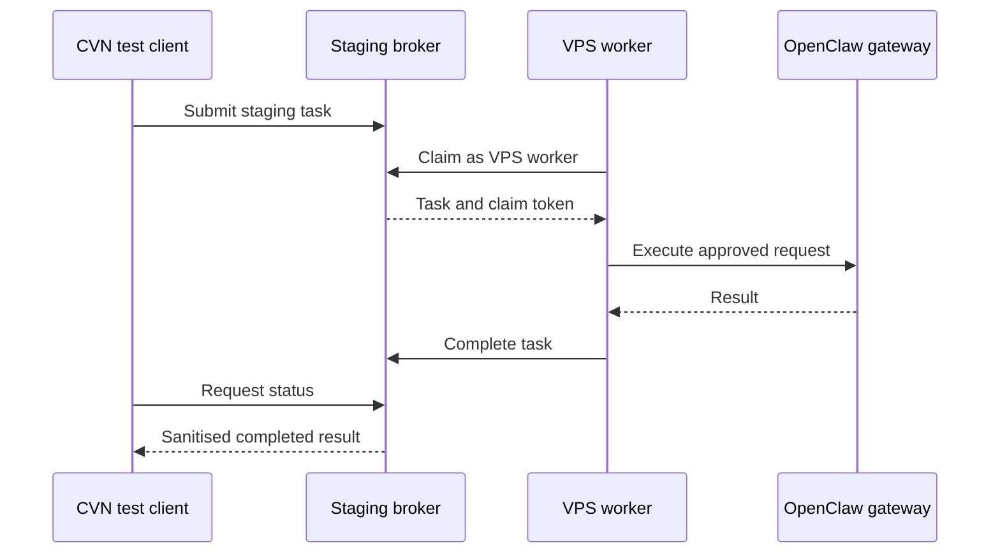

## Phase 2C.2 Technical Implementation Plan

### OpenClaw VPS worker provisioning and live staging integration

### Objective

Provision one VPS worker with a dedicated staging identity, connect it to the staging CVN broker and the local OpenClaw gateway, then complete a controlled end-to-end task:



No production deployment, merge, legacy-authentication removal or unrelated VPS changes are authorised.

---

# 1. Proposed Git state

Create a new branch from the signed-off Phase 2C.1 commit:

```bash
git switch feature/phase-2c-worker-identities
git pull --ff-only
git switch -c feature/phase-2c2-vps-staging-worker
```

Required base:

```text
4d5274e0d7c0409a2b535d506935cc2352136d81
```

Before implementation:

```bash
git rev-parse HEAD
git status --short
git log -1 --oneline
```

The branch should contain only Phase 2C.2 changes, such as:

* VPS provisioning documentation or scripts;
* systemd service template;
* worker configuration validation;
* health diagnostics;
* live staging test harness;
* operational runbook;
* narrowly scoped worker corrections discovered during integration.

Do not commit credentials, environment files, encrypted credential artefacts, task payloads containing private classroom information or raw gateway responses containing sensitive data.

---

# 2. Socratic Gate: parameters Antigravity must establish

Before changing the VPS, inspect and report:

1. VPS Linux distribution and version.
2. Whether systemd encrypted credentials are supported.
3. Python version and project virtual-environment location.
4. Existing CVN repository and deployment path.
5. Intended non-root service account.
6. Existing OpenClaw gateway service name and health.
7. OpenClaw gateway base URL or Unix socket.
8. Whether the gateway is bound only to loopback or a private interface.
9. Existing worker service names that could conflict.
10. Outbound HTTPS access to the staging Supabase project.
11. Time synchronisation status, because HMAC timestamps allow only a limited clock difference.
12. Secure route by which credentials will reach the VPS.
13. Existing firewall and service-hardening requirements.
14. How worker logs are retained and rotated.
15. Whether the broker worker is polling, one-shot or continuously supervised.

If any of these cannot be determined safely, stop before provisioning.

---

# 3. Identity allocation

Use the registered staging identity:

```text
Key ID: vps-worker-staging
Worker ID: vps-worker-id-staging
Allowed target: openclaw
```

The registry entry must remain restricted to:

```json
{
  "enabled": true,
  "allowed_targets": ["openclaw"],
  "allowed_worker_ids": ["vps-worker-id-staging"]
}
```

Generate fresh, staging-only values for:

* worker bearer token;
* worker HMAC secret;
* OpenClaw gateway token.

Requirements:

* use cryptographically secure random generation;
* do not reuse Windows, legacy or production credentials;
* do not transmit credentials through chat, Git, terminal recordings or command-line arguments;
* do not expose values in reports;
* keep a secure recovery copy only where required;
* record identifiers and fingerprints where useful, never secret values.

Register the new VPS credential alongside the permanent Windows entry. Do not replace or weaken the Windows/Hermes entry.

---

# 4. VPS service account and directories

Use a dedicated unprivileged account, provisionally:

```text
cvn-worker
```

Recommended layout:

```text
/opt/cvn-worker/             application deployment
/etc/cvn/                    non-secret configuration
/etc/cvn/credentials/        encrypted credential files
/var/lib/cvn-worker/         durable worker state if required
/var/log/cvn-worker/         only if not relying solely on journald
```

Security requirements:

* application files owned by root and read-only to the service where practical;
* runtime-state directory writable only by `cvn-worker`;
* credential directory inaccessible to other users;
* worker must not run as root;
* no interactive login for the service account;
* no inbound public port opened for the worker;
* OpenClaw gateway should remain loopback-only unless there is a documented reason otherwise.

Antigravity should adapt paths to the existing VPS layout instead of creating duplicates unnecessarily.

---

# 5. Application deployment

Deploy the exact Phase 2C.2 candidate commit rather than copying loose files.

Example flow:

```bash
cd /opt/cvn-worker
git fetch --all --prune
git switch feature/phase-2c2-vps-staging-worker
git pull --ff-only
git rev-parse HEAD
git status --short
```

Create or update the virtual environment using the project’s established dependency mechanism:

```bash
python3 -m venv .venv
.venv/bin/python -m pip install --upgrade pip
.venv/bin/python -m pip install -e .
```

If the project uses a lock file or another installation command, use that authoritative mechanism instead.

Before service activation, run:

```bash
.venv/bin/python -m compileall app
.venv/bin/python -m pytest tests/unit/test_broker_worker_routing.py -v
```

Run any OpenClaw adapter unit tests that do not contact production systems.

---

# 6. Non-secret configuration

The worker configuration should specify:

```text
Broker environment: staging
Supabase project: ukqkkgzimhtjhlnmlyao
Key ID: vps-worker-staging
Worker ID: vps-worker-id-staging
Target agent: openclaw
Gateway endpoint: locally verified OpenClaw endpoint
```

Expected environment variable:

```ini
Environment=AGENT_BROKER_KEY_ID=vps-worker-staging
```

Other non-secret settings may include:

* staging broker URL;
* worker ID;
* target agent;
* gateway URL;
* polling interval;
* request timeout;
* graceful shutdown timeout;
* log level;
* maximum retry count.

The service must fail closed if:

* key ID is missing;
* encrypted credentials cannot be loaded;
* worker ID is absent;
* target differs from `openclaw`;
* broker URL does not identify staging;
* gateway URL is malformed;
* gateway token is unavailable.

Production endpoints should be explicitly rejected during this phase.

---

# 7. Encrypted credential provisioning

Use systemd encrypted credentials where supported.

Required logical credentials:

```text
cvn-broker-bearer
cvn-broker-hmac
openclaw-gateway-token
```

The service configuration should map them using:

```ini
LoadCredentialEncrypted=cvn-broker-bearer:/etc/cvn/credentials/broker-bearer
LoadCredentialEncrypted=cvn-broker-hmac:/etc/cvn/credentials/broker-hmac
LoadCredentialEncrypted=openclaw-gateway-token:/etc/cvn/credentials/openclaw-gateway-token
```

The worker should read them from systemd’s credential directory, normally exposed through:

```text
%CREDENTIALS_DIRECTORY%
```

It must not expect the secret values directly in ordinary environment variables.

Provisioning rules:

1. Generate or receive plaintext secrets through an approved secure channel.
2. Write plaintext only to a restricted temporary location, preferably memory-backed.
3. Encrypt each credential for the VPS/systemd context.
4. Install only the encrypted artefacts under `/etc/cvn/credentials`.
5. Zero or remove temporary plaintext material immediately.
6. Confirm that no secret was added to shell history.
7. Search the repository and relevant configuration files for accidental leakage.
8. Never display credential contents during validation.

If systemd encrypted credentials are unsupported, stop and propose an alternative before using ordinary environment files.

---

# 8. Systemd service

A hardened service should resemble:

```ini
[Unit]
Description=CVN OpenClaw Staging Worker
After=network-online.target openclaw.service
Wants=network-online.target
Requires=openclaw.service

[Service]
Type=simple
User=cvn-worker
Group=cvn-worker
WorkingDirectory=/opt/cvn-worker

Environment=AGENT_BROKER_KEY_ID=vps-worker-staging
Environment=CVN_WORKER_ID=vps-worker-id-staging
Environment=CVN_TARGET_AGENT=openclaw
Environment=CVN_ENVIRONMENT=staging

LoadCredentialEncrypted=cvn-broker-bearer:/etc/cvn/credentials/broker-bearer
LoadCredentialEncrypted=cvn-broker-hmac:/etc/cvn/credentials/broker-hmac
LoadCredentialEncrypted=openclaw-gateway-token:/etc/cvn/credentials/openclaw-gateway-token

ExecStart=/opt/cvn-worker/.venv/bin/python -m app.worker.broker_worker
Restart=on-failure
RestartSec=10s
TimeoutStopSec=30s

NoNewPrivileges=true
PrivateTmp=true
ProtectSystem=strict
ProtectHome=true
ProtectKernelTunables=true
ProtectKernelModules=true
ProtectControlGroups=true
RestrictSUIDSGID=true
LockPersonality=true

[Install]
WantedBy=multi-user.target
```

This is a template, not a command to install blindly. Antigravity must confirm:

* the correct Python entry point;
* existing OpenClaw service name;
* required writable paths;
* whether strict systemd protections block legitimate operation.

Add `ReadWritePaths=` only for directories the worker genuinely needs.

---

# 9. Preflight verification

Before enabling continuous polling, keep the service stopped and run controlled checks.

### Infrastructure

```bash
timedatectl status
systemctl is-active openclaw.service
systemctl is-enabled openclaw.service
```

Verify:

* clock synchronisation is active;
* gateway service is healthy;
* gateway is not unintentionally public;
* DNS and HTTPS reach staging;
* staging project ID is correct.

### Configuration

Provide a safe diagnostic or dry-run mode that reports only:

* configuration fields present or absent;
* staging endpoint selected;
* key ID;
* worker ID;
* target;
* credential files readable: yes/no;
* gateway reachable: yes/no.

It must not print secret values, HMAC material, task payloads or gateway tokens.

### Negative authorisation checks

Before the live task:

1. VPS credential with `worker_id=windows-worker-id-staging` → `403`.
2. VPS credential claiming `target_agent=hermes` → `403`.
3. Invalid bearer → `401`.
4. Invalid signature → `401`.
5. Replayed signed request → `401`.
6. Correct VPS identity with no available task → authorised empty/no-task response.

These tests must leave no tasks stuck in a claimed state.

---

# 10. Worker activation

Install and validate the unit:

```bash
sudo systemctl daemon-reload
sudo systemctl start cvn-openclaw-staging-worker.service
sudo systemctl status cvn-openclaw-staging-worker.service
```

Do not enable it at boot until the live integration succeeds.

Inspect sanitised logs:

```bash
sudo journalctl -u cvn-openclaw-staging-worker.service --since "10 minutes ago"
```

Expected idle behaviour:

* authenticates successfully;
* polls only for `openclaw`;
* reports no task without excessive error logs;
* uses bounded backoff;
* does not continually restart;
* does not reveal credentials or task payloads.

---

# 11. Controlled live task

Use a synthetic, non-sensitive payload. Do not submit real student names, classroom observations, email contents or production instructions.

Recommended task:

> Return the exact text `CVN_OPENCLAW_STAGING_OK` and a short JSON health object containing only the execution status and adapter version.

Include a unique correlation identifier such as:

```text
phase-2c2-live-20260712-001
```

Before submission, record:

* test correlation ID;
* candidate Git commit;
* staging project reference;
* worker key ID;
* worker ID;
* OpenClaw adapter/gateway version;
* UTC and Brisbane start times.

---

# 12. End-to-end acceptance criteria

The live task must demonstrate every stage.

| Stage          | Required evidence                                         |
| -------------- | --------------------------------------------------------- |
| Submission     | Client receives a task ID without sensitive server fields |
| Routing        | Task has `target_agent=openclaw`                          |
| Claim          | VPS worker claims it using `vps-worker-id-staging`        |
| Isolation      | Windows/Hermes worker cannot claim it                     |
| Execution      | OpenClaw receives the synthetic instruction once          |
| Completion     | VPS worker completes using the correct claim token        |
| Status         | Client sees the completed state and expected result       |
| Sanitisation   | Status omits payload, claim token, queue ID and secrets   |
| Attribution    | Audit evidence identifies the VPS worker appropriately    |
| Replay defence | Reusing the completed claim or nonce is rejected          |
| Cleanup        | No task remains claimed or orphaned                       |
| Logging        | No secrets or prohibited payload fields appear            |
| Recovery       | Worker returns to healthy polling after completion        |

The expected response marker must be:

```text
CVN_OPENCLAW_STAGING_OK
```

---

# 13. Failure-path tests

After the successful task, run controlled synthetic failure cases.

### Gateway failure

Temporarily use an approved simulated gateway failure or fake endpoint. Verify:

* the worker reports failure through `cvn-fail-task`;
* retry behaviour matches policy;
* the task does not remain indefinitely claimed;
* diagnostic details are useful but sanitised.

Do not disrupt the real gateway if a test adapter can simulate this.

### Worker interruption

For a disposable task:

1. allow the worker to claim it;
2. stop the worker;
3. verify lease expiry/reaper behaviour;
4. restart the worker;
5. confirm the task becomes claimable or reaches the expected terminal state.

### Duplicate completion

Attempt a second completion using the same claim context. It must be rejected without altering the completed result.

### Wrong worker completion

Attempt completion with the Windows worker identity. It must return `403` and preserve task state.

---

# 14. Observability and evidence

Collect:

* Git commit and clean status;
* VPS operating-system and Python versions;
* systemd unit checksum;
* encrypted credential filenames—not contents;
* staging migration state;
* deployed Edge Function versions;
* OpenClaw gateway health result;
* task ID and correlation ID;
* timestamps for submission, claim, execution and completion;
* sanitised client status response;
* sanitised worker journal extracts;
* test commands and summaries;
* negative-test status codes;
* confirmation of cleanup.

Use `[REDACTED]` wherever output could contain:

* bearer tokens;
* HMAC secrets;
* signatures;
* gateway tokens;
* raw credential files;
* claim tokens;
* nonce values where disclosure is unnecessary;
* private payloads.

Do not commit an unredacted evidence file.

---

# 15. Rollback and stop protocol

Stop immediately if:

* the VPS points to production;
* the wrong Supabase project is selected;
* credentials appear in logs;
* the worker can claim `hermes`;
* the Windows worker can claim `openclaw`;
* task status exposes sensitive columns;
* HMAC or replay protection fails;
* the gateway is unintentionally public;
* task execution occurs more than once;
* the registry cannot be restored;
* any permanent staging credential is lost.

Safe rollback:

```bash
sudo systemctl disable --now cvn-openclaw-staging-worker.service
```

Then:

1. disable `vps-worker-staging` in the staging registry;
2. confirm its requests return `401`;
3. preserve sanitised diagnostic evidence;
4. restore the previous service version if necessary;
5. leave migration 007 and the verified Phase 2C.1 functions in place;
6. do not improvise a database rollback;
7. do not alter the Windows identity unless it is directly affected;
8. report the failure before proceeding.

---

# 16. Completion gate

Phase 2C.2 passes only when:

* the VPS service runs under a non-root account;
* encrypted credentials load successfully;
* the gateway remains locally protected;
* worker and target isolation pass;
* one synthetic task completes end to end;
* the response is sanitised;
* replay and duplicate operations are rejected;
* failure/recovery behaviour is verified;
* no task remains orphaned;
* no credentials leak;
* the registry remains healthy;
* all regression tests still pass;
* the implementation is frozen in a clean pushed commit;
* no production deployment or merge has occurred.

### Required Antigravity deliverable

Antigravity should return:

```text
Phase_2C2_VPS_Provisioning_and_Live_Staging_Report.md
```

The report should include the evidence above, deviations encountered, exact clean commit, test results, rollback readiness and a clear recommendation of either:

* `PASS — ready for merge review`, or
* `FAIL/BLOCKED — remediation required`.

This plan authorises controlled VPS provisioning and staging-only live verification. It does not authorise merging, production deployment, real classroom data, legacy-authentication removal or broad changes to the OpenClaw installation.
