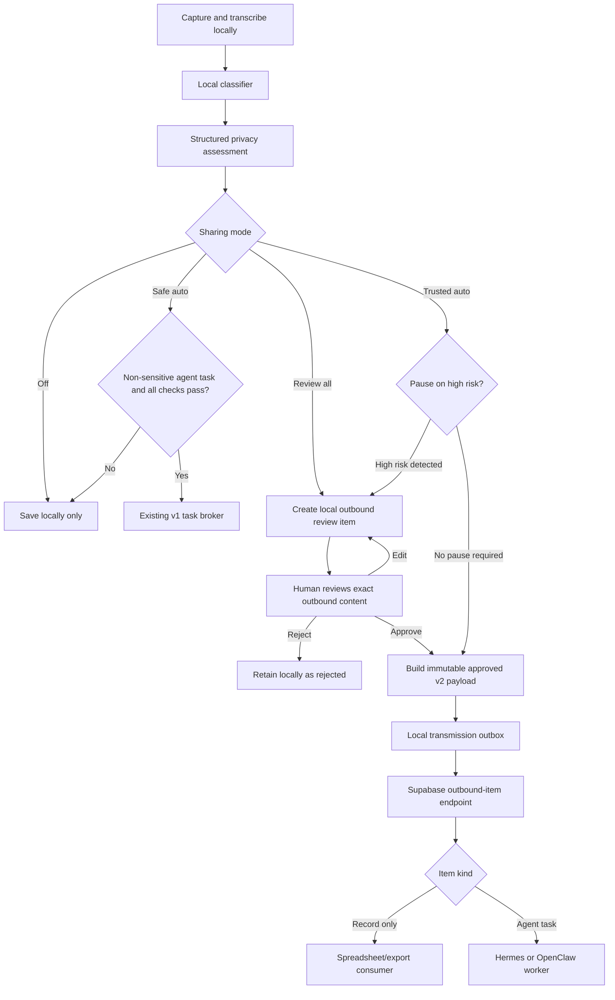

The recommended implementation preserves the existing safe automatic path and adds a separate reviewed/export path. This avoids weakening the current broker’s `non_sensitive` guarantee while supporting review-all and trusted non-sensitive environments.

# Outbound Sharing Modes — Implementation Plan

## 1. Objective

Add configurable outbound-sharing modes so Classroom Voice Notes can:

1. Retain its current automatic privacy filtering.
2. Allow every capture to be reviewed locally before transmission.
3. Optionally support trusted, non-sensitive environments where all captures are transmitted automatically.
4. Send structured records for spreadsheet population without treating every record as an instruction for an agent.
5. Preserve an audit trail showing why each item was released.

No transcript, metadata, or sensitive classification may reach Supabase before the applicable automatic or human approval decision.

---

## 2. Proposed user-facing modes

Replace the current single broker checkbox with an “External sharing mode” selection.

### `off`

- Nothing is sent externally.
- Local Obsidian behaviour remains unchanged.

### `safe_auto`

- Preserve current behaviour.
- Only `agent_task` captures classified as `non_sensitive` and passing every policy check are sent automatically.
- This remains the default whenever the broker was previously enabled.

### `review_all`

- Every completed capture is added to a new local outbound review queue.
- Nothing is transmitted until the user reviews the exact outgoing content and selects **Approve and send**.
- The automatic privacy filter supplies warnings and suggested redactions but does not silently discard the item.
- The user chooses whether the item is:
  - a database/spreadsheet record only; or
  - an executable agent task.

### `trusted_auto`

- All captures are automatically released after local classification.
- This is explicitly described as having no per-item human review.
- The filter still records risk findings and redactions.
- A “Pause items with high-risk findings” option should be enabled by default.
- Enabling this mode requires a warning and explicit confirmation.

The UI must not describe `trusted_auto` as “human in the loop.” The human makes a deployment-level trust decision, not a decision for each record.

---

## 3. Permanent safety boundaries

Even in `trusted_auto`, never transmit:

- WAV/audio files;
- secrets, API tokens or credentials;
- local filesystem paths;
- Obsidian configuration data;
- application logs;
- the student registry;
- machine-specific private configuration.

“All information” should mean the approved outbound record: transcript if enabled, summary, category, timestamp, tags and selected structured fields.

Introduce a separate setting for full transcript inclusion:

```json
{
  "external_agent": {
    "sharing_mode": "off",
    "include_full_transcript": false,
    "default_item_kind": "record_only",
    "trusted_pause_on_high_risk": true
  }
}
```

Full transcript inclusion should default to `false`.

---

## 4. Current implementation constraints

The developer should understand these before modifying code:

- The transcription pipeline currently invokes broker dispatch only for `agent_task` captures in [worker.py](../app/transcription/worker.py#L117).
- The dispatcher builds and checks a payload immediately before posting it in [external_agent_dispatcher.py](../app/destinations/external_agent_dispatcher.py#L51).
- The current policy requires `agent_task` and `non_sensitive` in [policy_gate.py](../app/ollama_router/policy_gate.py#L27).
- The payload builder hardcodes `privacy.classification` to `non_sensitive` and deliberately excludes the transcript in [payload_builder.py](../app/destinations/payload_builder.py#L34).
- Supabase validates the same assumption in [cvn-submit-task/index.ts](../supabase/functions/cvn-submit-task/index.ts#L55).
- The database has a check constraint that permits only `non_sensitive` task rows in [001_cvn_broker_mvp.sql](../supabase/migrations/001_cvn_broker_mvp.sql#L55).
- The existing Obsidian Review Queue is for reclassification and local routing. It is not a suitable outbound approval mechanism; see [review_manager.py](../app/destinations/review_manager.py#L31).
- The current broker worker executes OpenClaw tasks only. Its processing method rejects a Hermes target in [broker_worker.py](../app/worker/broker_worker.py#L247).

Do not remove or weaken the existing `cvn.agent_task.v1` path. Add a versioned outbound-item path alongside it.

---

## 5. Target flow



---

## 6. Phase 1 — Settings model and settings panel

### Files

- [settings.py](</C:/Users/dsuth/Documents/Code Projects/Classroom voice notes/app/config/settings.py:14>)
- [main_window.py](</C:/Users/dsuth/Documents/Code Projects/Classroom voice notes/app/ui/main_window.py:309>)
- [test_settings.py](</C:/Users/dsuth/Documents/Code Projects/Classroom voice notes/tests/unit/test_settings.py:1>)
- [test_main_window.py](</C:/Users/dsuth/Documents/Code Projects/Classroom voice notes/tests/unit/test_main_window.py:25>)

### Tasks

1. Add these defaults under `external_agent`:

```python
"sharing_mode": "off",
"include_full_transcript": False,
"default_item_kind": "record_only",
"trusted_pause_on_high_risk": True,
"review_retention_days": 30,
```

2. Keep `external_agent.enabled` temporarily for backward compatibility.

3. During settings loading, migrate old configurations:

- `enabled == false` and no `sharing_mode` → `off`
- `enabled == true` and no `sharing_mode` → `safe_auto`

4. Add a helper such as:

```python
def external_sharing_mode(self) -> str:
    ...
```

It must validate the stored value and return `off` for unknown values.

5. In the settings panel:

- Replace “Enable Supabase broker dispatching” with a combo box.
- Show plain-language descriptions beneath the selection.
- Add “Include full transcript” and “Pause high-risk items” checkboxes.
- Add a default item-kind selector: “Spreadsheet/database record” or “Agent task.”
- Disable irrelevant controls when the mode is `off`.
- Show a modal warning when `trusted_auto` is selected.
- If the user cancels the warning, restore the previous mode.

6. Save all settings together before reloading the controller. Avoid leaving a partially saved mode if validation is cancelled.

### Tests

- Defaults use `off`.
- Existing enabled settings migrate to `safe_auto`.
- Unknown modes fail closed to `off`.
- UI loads and saves all new fields.
- Cancelling the trusted-mode warning does not enable the mode.
- Existing settings tests continue to pass.

---

## 7. Phase 2 — Structured privacy assessment

### Files

- Refactor [policy_gate.py](</C:/Users/dsuth/Documents/Code Projects/Classroom voice notes/app/ollama_router/policy_gate.py:27>)
- Add `app/privacy/outbound_assessment.py`
- Extend [test_policy_gate_hardened.py](</C:/Users/dsuth/Documents/Code Projects/Classroom voice notes/tests/unit/test_policy_gate_hardened.py:52>)

### Data model

Create a typed result rather than returning only `(allowed, checks)`:

```python
@dataclass(frozen=True)
class OutboundAssessment:
    automatic_classification: str
    risk_level: str              # low, medium, high
    findings: list[str]
    checks_passed: list[str]
    suggested_redactions: list[str]
    safe_auto_allowed: bool
```

### Refactoring rules

1. Extract assessment from release decisions.

2. Preserve `is_external_dispatch_allowed()` as a compatibility wrapper:

```python
assessment = assess_outbound(...)
return assessment.safe_auto_allowed, assessment.checks_passed
```

3. Separate checks into:

- **Transport/security checks:** endpoint allowlist, payload size, required fields, credentials and schema. These can never be bypassed.
- **Privacy findings:** sensitivity, student-name matches, contact details, welfare terms and similar content.
- **Routing checks:** item kind and supported target agent.

4. Do not log detected names, transcript excerpts or contact details. Log finding codes only.

5. Suggested redactions must not modify the original local note automatically.

### Tests

Test every finding separately, combinations of findings, missing registry, unknown sensitivity and low-confidence classification. Confirm logs and returned findings contain no sensitive source text.

---

## 8. Phase 3 — Local outbound review queue

Do not reuse the existing Obsidian checkbox review queue.

### New file

`app/destinations/outbound_review_store.py`

### Storage

Use a separate SQLite database, for example:

`outbound_review.db`

Create a `review_items` table:

```sql
review_id           INTEGER PRIMARY KEY AUTOINCREMENT
item_id             TEXT UNIQUE NOT NULL
created_at          TEXT NOT NULL
updated_at          TEXT NOT NULL
note_path           TEXT NOT NULL
item_kind           TEXT NOT NULL
target_agent        TEXT
draft_json          TEXT NOT NULL
content_hash        TEXT NOT NULL
assessment_json     TEXT NOT NULL
status              TEXT NOT NULL
approved_at         TEXT
approval_method     TEXT
rejected_at         TEXT
rejection_reason    TEXT
outbox_local_id     INTEGER
```

Allowed states:

- `awaiting_review`
- `approved`
- `rejected`
- `queued`
- `sent`
- `failed`
- `expired`

### Required methods

- `create_review_item(...)`
- `get_awaiting_review(...)`
- `get_by_id(...)`
- `update_draft(...)`
- `approve(...)`
- `reject(...)`
- `mark_queued(...)`
- `mark_sent(...)`
- `expire_old(...)`
- `get_stats(...)`

### Integrity rules

- Calculate `content_hash` using deterministic JSON.
- Editing a draft recalculates its hash and clears any previous approval.
- Approval records the hash of the exact reviewed content.
- The approved content becomes immutable.
- Rejecting an item never deletes the associated local note.
- Expiry must not send an item.

Use parameterised SQL everywhere.

---

## 9. Phase 4 — Central outbound routing service

### New file

`app/destinations/outbound_routing_service.py`

Move mode-specific decisions out of the transcription worker.

Suggested entry point:

```python
def handle_capture(
    self,
    classification: dict[str, Any],
    transcript: str,
    note_path: str,
    recorded_at: str,
    duration_seconds: int,
) -> OutboundRoutingResult:
    ...
```

### Behaviour

#### `off`

Return without creating a review or outbox record.

#### `safe_auto`

Use the current v1 dispatcher only when:

- category is `agent_task`;
- assessment allows safe automatic dispatch.

#### `review_all`

Build a review draft for every capture and store it locally. Make no HTTP request.

#### `trusted_auto`

- Build the same draft and assessment.
- If high risk and pause-on-high-risk is enabled, create `awaiting_review`.
- Otherwise record `approval_method = trusted_mode`, create the v2 payload and enqueue it.

### Transcription worker change

Replace the current direct dispatcher import and conditions with one call to `OutboundRoutingService`.

The local Obsidian note must be successfully written before any outbound item is created. Preserve the local note even if routing fails.

Add frontmatter fields containing identifiers and states only:

```yaml
external_item_id: CVNI-...
external_state: awaiting_review
```

Do not duplicate approved payload content into frontmatter.

---

## 10. Phase 5 — Outbound review UI

### New file

`app/ui/outbound_review_dialog.py`

Add an **Outbound Review** button and pending count to the broker section of the settings window.

### List view

Show:

- captured time;
- title;
- automatic category;
- risk level;
- item kind;
- target agent;
- status.

Use clear colours and text; do not rely on colour alone.

### Detail view

Show the exact fields that will be transmitted:

- title;
- summary;
- transcript, if included;
- category and tags;
- structured fields;
- item kind;
- agent target;
- agent instructions when applicable;
- privacy findings.

Make outbound title, summary, transcript and instructions editable without altering the original local note.

### Actions

- **Save edits**
- **Approve and send**
- **Reject**
- **Open local note**
- **Apply suggested redactions**, if deterministic suggestions are available

Approval behaviour:

1. Save current edits.
2. Recalculate the assessment and content hash.
3. Show a final read-only preview.
4. For high-risk content, display a second confirmation explaining that the content will leave the computer.
5. Approve the exact hash.
6. Build and enqueue the payload.
7. Update the UI state to `queued`.

Never perform network calls on the Qt UI thread. Use the existing outbox worker pattern.

---

## 11. Phase 6 — Versioned outbound payload

Keep `cvn.agent_task.v1` unchanged for `safe_auto`.

Introduce:

```text
cvn.outbound_item.v2
```

Example:

```json
{
  "schema_version": "cvn.outbound_item.v2",
  "item_id": "CVNI-20260801-153000-ABCD",
  "created_at": "2026-08-01T05:30:00Z",
  "source": "classroom_voice_notes",
  "source_device_id": "cvn-device",
  "item_kind": "record_only",
  "target_agent": "openclaw",
  "content": {
    "title": "Fractions lesson reflection",
    "summary": "Summary approved for export.",
    "transcript": null,
    "category": "maths_note",
    "tags": ["fractions"],
    "structured_fields": {}
  },
  "privacy": {
    "automatic_classification": "non_sensitive",
    "risk_level": "low",
    "findings": [],
    "policy_gate_version": "2.0.0",
    "release_basis": "human_approval",
    "approval": {
      "approved_at": "2026-08-01T05:32:00Z",
      "approved_content_hash": "...",
      "reviewer_type": "local_user"
    }
  },
  "task": null,
  "content_hash": "...",
  "idempotency_key": "...",
  "signed_at": "...",
  "nonce": "..."
}
```

For `agent_task`, `task` must contain title, instructions and priority.

### Rules

- Keep the actual automatic classification. Never relabel sensitive content as `non_sensitive`.
- Use `release_basis` to explain why transmission was permitted:
  - `automatic_policy`
  - `human_approval`
  - `trusted_mode`
- `record_only` must never be interpreted as permission to execute an arbitrary task.
- Hash only the canonical `content`, `item_kind`, `target_agent` and `task` fields for approval.
- The HMAC signs the complete final envelope.

Add `app/destinations/outbound_payload_builder.py` rather than complicating the existing v1 builder.

---

## 12. Phase 7 — Dispatcher and retry handling

Refactor dispatch into three operations:

1. Prepare approved payload.
2. Store payload in the local transmission outbox.
3. Transmit pending outbox records.

Extend the local outbox with:

- `schema_version`
- `item_kind`
- `review_id`
- `release_basis`

Do not change existing columns destructively.

### Retry correction

The current retry path reuses stored `signed_at` and `nonce`. The server rejects requests whose timestamp is more than five minutes old. For v2:

- Keep `item_id`, `idempotency_key`, approved content and content hash stable.
- Generate a fresh transport `signed_at` and nonce for each attempt.
- Rebuild and sign the envelope immediately before transmission.
- Do not allow the regenerated envelope to alter the approved content.
- Treat a duplicate idempotency response as successful only when it identifies the same item.

Add tests for a retry occurring more than five minutes after approval.

---

## 13. Phase 8 — Supabase implementation

Create additive migration:

```text
supabase/migrations/008_cvn_outbound_items.sql
```

Do not relax the current `cvn_tasks` privacy constraint.

### New table

`public.cvn_outbound_items`

Suggested fields:

- `item_id`
- `created_at`
- `source_device_id`
- `item_kind`
- `target_agent`
- `status`
- `payload_json`
- `payload_hash`
- `content_hash`
- `automatic_classification`
- `risk_level`
- `release_basis`
- `approved_at`
- `policy_gate_version`
- `idempotency_key`
- `nonce`
- claim/completion/failure fields

### Database validation

The submission function must enforce:

- `automatic_policy` requires `non_sensitive`, low risk and required checks.
- `human_approval` requires approval time and approved content hash.
- `trusted_mode` requires the signed trusted release basis.
- Sensitive or unknown content without human/trusted release basis is rejected.
- `record_only` cannot contain executable task instructions.
- `agent_task` requires an allowlisted target and task structure.
- Unique idempotency and nonce constraints remain.
- Payload and field length limits are enforced.

### New Edge Function

Add:

```text
supabase/functions/cvn-submit-outbound-item/index.ts
```

It should:

- reuse the shared authentication implementation;
- verify HMAC before processing;
- validate the v2 schema;
- recalculate the content hash;
- compare it with the approved content hash;
- call a security-definer RPC;
- return only identifiers and status;
- avoid logging payload contents.

Add target-specific queues or a clearly separated queue for outbound items. Do not put full payloads in queue messages; enqueue item IDs only.

---

## 14. Phase 9 — Downstream consumers

Treat export and execution as different capabilities.

### `record_only`

A record consumer should write the approved structured fields to the spreadsheet or export destination. It must:

- be idempotent by `item_id`;
- never reinterpret the record as an instruction;
- report success/failure to the broker;
- avoid putting secrets into spreadsheet cells;
- store the resulting spreadsheet row identifier in task metadata.

The spreadsheet provider and authentication method need a separate decision. Do not place spreadsheet credentials in `settings.json`.

### `agent_task`

Route through an agent adapter.

Refactor the worker around an adapter interface:

```python
class TaskAdapter(Protocol):
    def validate_task(self, payload: dict) -> None: ...
    def convert_task(self, payload: dict) -> dict: ...
    def execute(self, request: dict, timeout_seconds: int) -> dict: ...
    def validate_response(self, response: dict) -> dict: ...
```

Register adapters by target rather than hardcoding an OpenClaw-only branch.

The current repository does not contain a functioning Hermes execution adapter. Until one is implemented:

- the UI may show Hermes as unavailable for v2 execution; or
- the server must reject Hermes `agent_task` submissions with a clear validation error.

Do not mark Hermes support complete merely because the broker can route a Hermes queue.

---

## 15. Audit and retention

Add audit events using identifiers and finding codes only:

- `OUTBOUND_REVIEW_CREATED`
- `OUTBOUND_REVIEW_EDITED`
- `OUTBOUND_REVIEW_APPROVED`
- `OUTBOUND_REVIEW_REJECTED`
- `OUTBOUND_TRUSTED_RELEASE`
- `OUTBOUND_QUEUED`
- `OUTBOUND_SENT`
- `OUTBOUND_EXPORT_COMPLETED`

Never include transcripts, names, email addresses or full payloads in audit messages.

Retention behaviour:

- Default local rejected/review-item retention: 30 days.
- Never delete the original Obsidian note as part of review cleanup.
- Define remote payload retention before production rollout.
- Provide a future deletion/export process for remote records containing personal information.

---

## 16. Test plan

### Unit tests

Add or extend tests for:

- setting migration and validation;
- every sharing mode;
- privacy assessment result structure;
- review-store creation, editing, approval and rejection;
- edit-after-approval invalidation;
- deterministic content hashing;
- payload v2 construction;
- record/task separation;
- trusted-mode high-risk pause;
- dispatcher retry with fresh timestamps;
- UI warning and confirmation behaviour;
- no network request before human approval.

### Integration tests

Use synthetic data only:

1. `off` creates no outbound rows.
2. `safe_auto` preserves current behaviour.
3. `review_all` creates a local review item and performs zero HTTP calls.
4. Approval sends the exact previewed content.
5. Editing content changes the hash and requires approval again.
6. Rejection never sends.
7. Sensitive content without approval receives a server rejection.
8. Sensitive content with valid human approval is accepted by the v2 endpoint.
9. A `record_only` item reaches only the export consumer.
10. An `agent_task` reaches only its selected agent.
11. Duplicate delivery creates one spreadsheet row.
12. A retry after five minutes succeeds with a fresh transport signature.
13. Audio, file paths and secrets remain absent from payloads and logs.

### Regression commands

```text
uv run pytest tests/unit
uv run pytest tests/integration
uv run mypy app
uv run ruff check app tests
```

Live integration tests must remain opt-in and staging-only.

---

## 17. Recommended pull-request sequence

### PR 1 — Settings and assessment model

- New modes and migration.
- Structured assessment.
- No dispatch behaviour changes.
- Unit tests.

### PR 2 — Local review storage and UI

- SQLite review store.
- Review list and detail dialog.
- Approval hashing.
- No cloud submission yet.

### PR 3 — Routing service

- Central mode handling.
- `review_all` staging.
- Preserve current `safe_auto`.
- Controller notifications and counts.

### PR 4 — Payload v2 and local dispatcher

- V2 builder.
- Outbox extensions.
- Retry freshness correction.
- Mocked HTTP tests.

### PR 5 — Supabase migration and Edge Function

- New table, RPC, queues and endpoint.
- Server validation.
- Staging deployment and synthetic tests.

### PR 6 — Record/export consumer

- Idempotent record handling.
- Spreadsheet integration after provider selection.
- Completion and failure reporting.

### PR 7 — Agent adapters

- Adapter registry.
- OpenClaw v2 support.
- Hermes adapter only when a real Hermes execution endpoint is available.

### PR 8 — Production hardening

- Retention configuration.
- Documentation.
- Full regression suite.
- Staged enablement.

Each PR should be independently testable and should not require weakening the v1 production broker.

---

## 18. Definition of done

The feature is complete when:

- Existing users retain the current safe behaviour after upgrading.
- `review_all` performs no external request before approval.
- The preview exactly matches the content subsequently sent.
- Editing approved content invalidates approval.
- Automatic sensitivity findings remain visible in every mode.
- Sensitive content is never mislabelled as non-sensitive.
- Record-only items cannot execute agent instructions.
- Agent tasks cannot enter the record-only consumer.
- All retries are idempotent.
- No audio, local paths, secrets or student-registry data are transmitted.
- OpenClaw and Hermes availability is represented accurately.
- Staging tests pass using synthetic sensitive and non-sensitive examples.
- Production remains disabled until the new endpoint, consumer and retention policy are verified.