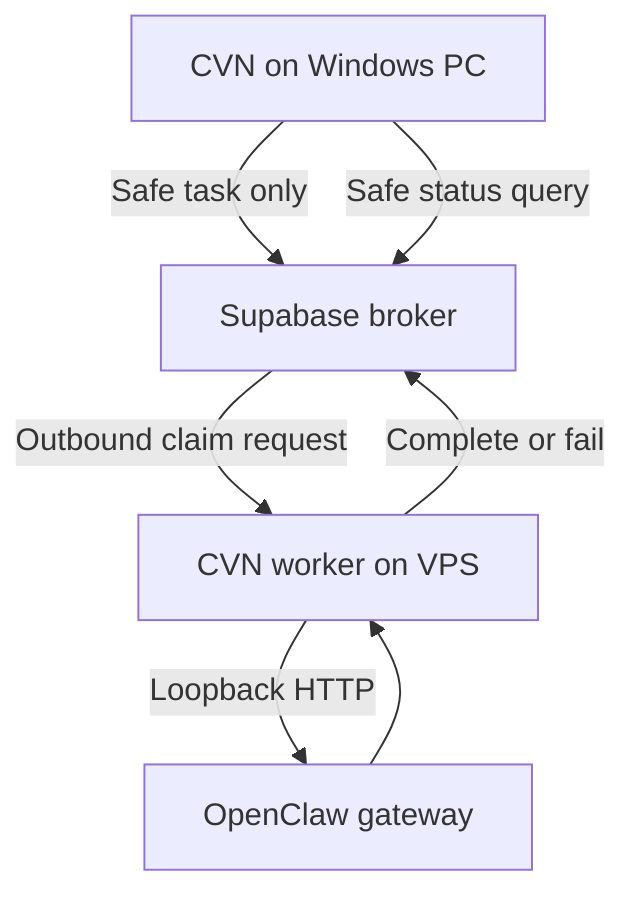

# Phase 2C: OpenClaw Adapter Design and VPS Integration

**Project:** Classroom Voice Notes (CVN) Broker
**Phase:** 2C
**Environment:** Staging first
**Date:** 10 July 2026
**Status:** Revised implementation plan — awaiting execution

## 1. Purpose

Phase 2C connects the verified Supabase broker to the OpenClaw agent running on the VPS. It replaces simulated processing with a carefully isolated adapter while preserving the broker behaviour proven during Phase 2B.

The phase must demonstrate this complete path:

1. CVN submits an approved, non-sensitive task to the Supabase broker.
2. A continuously running worker on the VPS claims the task.
3. The worker validates the task against the CVN worker contract.
4. The OpenClaw adapter converts it into an OpenClaw request.
5. The adapter calls the OpenClaw gateway through VPS loopback.
6. OpenClaw produces a bounded, text-only response.
7. The worker validates and sanitises the response.
8. The worker completes or fails the broker task.
9. CVN retrieves the safe status and result from Supabase.

Phase 2C does not authorise production deployment, unrestricted OpenClaw tools, filesystem access, email access, browser access or external actions.

## 2. Confirmed architecture

OpenClaw does not run on the Windows classroom computer. It runs on a remotely hosted VPS. Therefore, the production worker and OpenClaw adapter will also run on the VPS, beside the OpenClaw gateway.



### 2.1 Component locations

| Component | Location | Purpose |
| --- | --- | --- |
| CVN desktop application | Windows classroom computer | Captures notes, applies the local privacy gate and submits safe tasks |
| Phase 2B dummy worker | Windows development environment | Staging tests and broker diagnostics only |
| Test submission and status CLI tools | Windows development environment | Controlled staging verification |
| Supabase broker | Hosted Supabase project | Durable task state, queueing, authentication and status retrieval |
| Production broker worker | VPS | Claims tasks and coordinates agent execution |
| OpenClaw adapter | VPS | Translates validated CVN tasks into OpenClaw requests |
| OpenClaw gateway and agent | VPS | Performs the permitted analysis or coding work |

### 2.2 Network paths

The production worker requires only outbound access to Supabase. The OpenClaw adapter communicates with the gateway locally on the VPS:

```text
http://127.0.0.1:18789/v1/responses
```

Port `18789` must remain bound to loopback and must not be directly exposed to the public internet. Remote administration should use an existing protected method such as an SSH tunnel or private Tailscale connection.

No new inbound port is required for the CVN worker.

## 3. Enduring logical agent names

The `target_agent` database column represents a logical destination rather than an implementation technology.

Confirmed logical agents are:

- `hermes` — planning and instruction work.
- `openclaw` — coding and analysis work.

Worker routing must follow `target_agent`. A task must not be sent to OpenClaw merely because it is a classroom-note task.

Initial Phase 2C routing rules:

| `target_agent` | Behaviour |
| --- | --- |
| `openclaw` | Validate and dispatch through `OpenClawAdapter` |
| `hermes` | Reject as unsupported until a separate Hermes adapter is implemented |
| Unknown value | Permanent validation failure |

## 4. OpenClaw gateway contract

Phase 2C will use OpenClaw's OpenResponses-compatible HTTP endpoint:

```text
POST /v1/responses
```

The endpoint runs on the existing gateway port. It must be enabled on the VPS:

```json5
{
  gateway: {
    bind: "loopback",
    auth: {
      mode: "token"
    },
    http: {
      endpoints: {
        responses: {
          enabled: true
        }
      }
    }
  }
}
```

The adapter will use bearer authentication and a dedicated OpenClaw agent target. A suitable initial request is:

```json
{
  "model": "openclaw/cvn-broker",
  "input": "Return exactly: CVN adapter connection successful.",
  "user": "cvn-task:CVN-20260710-EXAMPLE",
  "stream": false,
  "max_output_tokens": 200
}
```

Required headers:

```http
Authorization: Bearer <gateway-token>
Content-Type: application/json
```

The CVN `task_id` must be retained as the correlation identifier in local logs, the request's stable `user` value and the validated result metadata. It is not an authentication credential.

References:

- [OpenClaw OpenResponses API](https://docs.openclaw.ai/gateway/openresponses-http-api)
- [OpenClaw gateway runbook](https://docs.openclaw.ai/gateway)
- [OpenClaw VPS guidance](https://docs.openclaw.ai/vps)
- [OpenClaw gateway exposure runbook](https://docs.openclaw.ai/gateway/security/exposure-runbook)

## 5. Security boundary

### 5.1 Dedicated restricted agent

Create a dedicated OpenClaw agent with the identifier `cvn-broker`. During Phase 2C it must be text-only and configured without:

- Filesystem tools.
- Shell, terminal or coding execution tools.
- Email, messaging or calendar tools.
- Browser or external network tools.
- Gateway administration tools.
- Sub-agent creation.
- Cron or scheduled-action tools.
- Elevated permissions.

The adapter must not rely on response sanitisation to prevent actions. Tool denial must be enforced in the OpenClaw agent configuration before execution. Sanitisation only protects the result returned to the broker.

OpenClaw bearer authentication represents a powerful operator boundary. The gateway must remain loopback-only, and its token must be handled as a high-value secret.

### 5.2 Data boundary

Only material already approved by CVN's local privacy gate may enter the broker. Phase 2C must use synthetic content during verification and must not send real student information.

The adapter must never log:

- Raw task payloads.
- Raw OpenClaw prompts or responses.
- Student or staff information.
- Supabase bearer tokens or HMAC secrets.
- OpenClaw gateway tokens.
- HMAC signatures or nonces.
- Authorisation headers.

Permitted operational logs include:

- Task ID.
- Contract version.
- Task type.
- Logical target agent.
- Attempt and retry count.
- Transition name.
- Sanitised error code.
- Duration.
- HTTP status category where safe.

### 5.3 VPS credentials

Windows Credential Manager remains appropriate for Windows staging tools, but it is not the credential source for the Linux VPS worker.

Create separate VPS credentials for:

- Supabase worker bearer authentication.
- Supabase worker HMAC signing.
- OpenClaw gateway authentication.

Inject these through a protected VPS mechanism such as systemd credentials or a root-readable environment file with restrictive permissions. Do not commit them, print them, place them in command histories or copy the Windows test credentials to the VPS.

Run the following security check on the VPS after gateway changes:

```bash
openclaw security audit --deep
```

Critical findings must be resolved before the adapter is enabled.

## 6. Execution time and duplicate-work protection

Broker claims expire after `1,800` seconds (30 minutes). The adapter will have a configurable upper execution limit no greater than `1,500` seconds (25 minutes), preserving a five-minute margin for broker completion or failure reporting.

However, an HTTP client timeout only stops the adapter from waiting. It does not prove that the OpenClaw gateway stopped the agent run. A timed-out run could continue on the VPS.

Therefore:

- Initial Phase 2C tasks should normally complete within 120 seconds.
- The adapter timeout must be configurable for tests.
- The 1,500-second value is an absolute ceiling, not a normal target.
- A read timeout after dispatch is classified as `execution_state_unknown`.
- An unknown execution must not be automatically resubmitted during Phase 2C.
- Timeout tests must use mocks or a short test timeout rather than waiting 25 minutes.
- Long-running or side-effecting work remains blocked until cancellation, execution-status recovery or broker claim renewal is implemented.

## 7. Proposed code structure

The Phase 2B dummy worker must remain a test tool. Do not convert it into the production worker.

Recommended structure:

```text
app/
  destinations/
    base_adapter.py
    dummy_adapter.py
    openclaw_adapter.py
  worker/
    broker_worker.py
    errors.py
    result_validation.py

scripts/
  watch_inbox_dummy.py
  watch_inbox_worker.py
  submit_test_task.py
  check_task_status.py

tests/
  unit/
    test_openclaw_adapter.py
    test_broker_worker_routing.py
  integration/
    test_openclaw_staging.py
```

Existing repository conventions take precedence if equivalent directories already exist.

### 7.1 Base adapter interface

Define a small adapter interface shared by dummy and real processors:

```python
class TaskAdapter(Protocol):
    def validate_task(self, task: dict) -> None: ...
    def convert_task(self, task: dict) -> dict: ...
    def execute(self, request: dict) -> dict: ...
    def validate_response(self, response: dict) -> dict: ...
```

Validation should raise typed exceptions rather than returning only `True` or `False`.

### 7.2 OpenClaw adapter

Create `OpenClawAdapter` with these responsibilities:

1. Validate the broker task envelope and contract version.
2. Confirm that `target_agent` is `openclaw`.
3. Confirm that the task type is allowlisted.
4. Map the safe payload into an OpenResponses request.
5. Send the request to the loopback gateway with explicit connect and read timeouts.
6. Parse the OpenResponses result.
7. Reject unexpected tool calls or unsupported output items.
8. Apply response size and schema limits.
9. Produce a sanitised broker result or raise a typed error.

The adapter is not responsible for claiming tasks, broker retries or task-state transitions.

### 7.3 Production broker worker

Create a separate production worker that:

1. Loads non-secret configuration and injected VPS credentials.
2. Polls the Supabase claim endpoint.
3. Validates basic task routing.
4. Selects the adapter from `target_agent`.
5. Invokes the adapter.
6. Calls the complete or fail endpoint using the current claim token.
7. Applies the Phase 2B backoff and authentication rules.
8. Emits privacy-safe structured logs.
9. Shuts down cleanly when stopped by the service manager.

The worker must never execute a task through a fallback adapter when its requested logical destination is unavailable.

## 8. Configuration

Add an `openclaw` settings block equivalent to:

```json
{
  "openclaw": {
    "gateway_url": "http://127.0.0.1:18789",
    "responses_path": "/v1/responses",
    "agent_id": "cvn-broker",
    "normal_timeout_seconds": 120,
    "maximum_timeout_seconds": 1500,
    "maximum_output_tokens": 2000,
    "maximum_result_characters": 20000
  }
}
```

The gateway token must not appear in this settings block. It must be injected separately through the VPS secret mechanism.

## 9. Error classification

Define typed worker errors:

- `UnsupportedContractVersion`
- `UnsupportedTaskType`
- `UnsupportedTargetAgent`
- `InvalidTaskPayload`
- `GatewayAuthenticationError`
- `GatewayUnavailableError`
- `GatewayRateLimitError`
- `GatewayConfigurationError`
- `GatewayResponseError`
- `ExecutionTimeoutUnknown`
- `InvalidAgentResponse`

Initial HTTP mapping:

| Condition | Worker classification | Broker behaviour |
| --- | --- | --- |
| HTTP 400 or 422 | Permanent task/request failure | Fail without automatic redispatch |
| HTTP 401 or 403 | Fatal worker configuration error | Stop worker and alert operator |
| HTTP 404 or 405 | Fatal gateway configuration error | Stop worker and alert operator |
| HTTP 408 before execution is accepted | Retryable gateway failure | Apply controlled broker retry |
| HTTP 429 | Retryable rate limit | Honour `Retry-After` where available |
| HTTP 5xx | Retryable gateway failure | Apply bounded retry/backoff |
| Connection refused before dispatch | Retryable gateway unavailable | Apply bounded retry/backoff |
| Read timeout after dispatch | Execution state unknown | Do not automatically redispatch |
| Successful HTTP response with invalid schema | Permanent response-validation failure | Fail safely and retain diagnostics |

If the current broker fail endpoint cannot distinguish retryable, permanent and unknown failures, Phase 2C must not pretend that it can. Either extend the broker contract in a separately reviewed migration or hold unknown/permanent tasks without automatic redispatch.

## 10. Worker contract updates

Update `003-cvn-worker-contract.md` to include:

- `openclaw` as an allowed logical target.
- The initial OpenClaw task-type allowlist.
- Contract version handling.
- Required payload and result schemas.
- Maximum input and output sizes.
- Correlation using `task_id`.
- Retryable, permanent and unknown execution states.
- The 1,800-second claim timeout and 1,500-second adapter ceiling.
- The prohibition on automatic retry after an unknown execution state.
- Logging and privacy restrictions.
- Idempotency expectations.

Initial verification should use `cvn.test`. `classroom_note.summary` may be enabled only after the echo flow passes, using synthetic text.

## 11. Automated verification

### 11.1 Adapter unit tests

Add tests for:

- Valid and invalid envelope versions.
- Allowed and unsupported target agents.
- Allowed and unsupported task types.
- Missing and malformed payload fields.
- Correct `/v1/responses` request formatting.
- Correct `model`, `user`, `stream` and output-limit fields.
- Gateway token exclusion from logs.
- Valid response extraction.
- Unexpected output items.
- Oversized output rejection.
- Response sanitisation.
- HTTP error mapping.
- Connect timeout versus read-timeout classification.
- `execution_state_unknown` not being automatically retried.

All gateway tests must use mocks and must not require a live VPS.

### 11.2 Worker routing tests

Add tests proving that:

- `openclaw` selects only `OpenClawAdapter`.
- `hermes` is not silently redirected to OpenClaw.
- Unknown targets fail permanently.
- Adapter success calls the complete endpoint once.
- Retryable failures call the fail endpoint according to the broker contract.
- Fatal authentication/configuration failures stop the worker.
- Unknown execution state is held without duplicate dispatch.

### 11.3 Regression tests

Rerun the existing Milestone 2 integration suite after the refactor. All nine broker scenarios and the Phase 2B dummy-worker behaviours must remain green.

## 12. VPS deployment and manual verification

### Gate 1: VPS gateway readiness

1. Confirm the OpenClaw gateway is healthy on the VPS.
2. Create the restricted `cvn-broker` agent.
3. Enable the `/v1/responses` endpoint.
4. Confirm the gateway remains loopback-only.
5. Run the OpenClaw security audit.
6. From the VPS, call `GET /v1/models` and verify the intended agent target appears.
7. Send a harmless direct echo request and verify the response.

### Gate 2: Worker installation

1. Install the production worker code on the VPS.
2. Create separate staging worker credentials.
3. Inject credentials through the approved VPS mechanism.
4. Configure the staging Supabase project only.
5. Install the worker as a supervised systemd service.
6. Verify service start, stop, restart and log redaction.

### Gate 3: Full staging path

Submit a synthetic task from Windows:

```json
{
  "target_agent": "openclaw",
  "task_type": "cvn.test",
  "payload": {
    "mode": "echo",
    "text": "Return exactly: CVN adapter connection successful."
  }
}
```

Verify:

- CVN or the CLI submits the task to staging.
- The VPS worker claims it.
- The adapter calls OpenClaw through VPS loopback.
- The request is correlated by `task_id`.
- The agent returns only the permitted response.
- The worker validates the response.
- The task becomes `completed`.
- The safe status endpoint returns the expected summary.
- No sensitive content appears in Windows, Supabase, VPS or OpenClaw logs.

### Gate 4: Failure behaviour

Verify:

- OpenClaw gateway unavailable before dispatch.
- Invalid OpenClaw gateway token.
- Unsupported contract version.
- Unsupported task type.
- Invalid response schema.
- Oversized response.
- Short simulated read timeout.
- VPS worker restart while idle.
- VPS worker restart after claim but before dispatch.
- Temporary Supabase outage and recovery.

The timeout test must confirm that an unknown execution is not automatically duplicated.

### Gate 5: First domain task

After all earlier gates pass, enable one synthetic `classroom_note.summary` task. Do not use real classroom information during Phase 2C verification.

## 13. Service operations

The production worker should run as a supervised service with:

- Automatic start after VPS reboot.
- Restart after unexpected worker failure.
- A bounded restart delay.
- Clean shutdown handling.
- Privacy-safe journald or equivalent logging.
- No credentials in unit files, process arguments or logs.
- A documented health-check command.
- A documented rollback procedure.

Operational checks should distinguish:

- Worker process health.
- Supabase connectivity.
- OpenClaw gateway reachability.
- OpenClaw authentication.
- Agent availability.
- Queue activity.

## 14. Phase 2C acceptance criteria

Phase 2C is complete only when:

- The Phase 2B state is frozen at a named commit.
- All existing broker tests remain green.
- The adapter unit tests pass.
- Worker routing tests pass.
- The restricted `cvn-broker` agent exists on the VPS.
- `/v1/responses` is enabled and reachable only through the intended private boundary.
- The OpenClaw security audit has no unresolved critical findings.
- The production worker runs as a supervised VPS service.
- A synthetic echo task completes through the full Windows–Supabase–VPS–OpenClaw path.
- Authentication, unavailable-gateway and malformed-response failures behave safely.
- Unknown execution states are not automatically duplicated.
- Logs contain no secrets or raw protected payloads.
- A synthetic classroom-note summary passes end to end.
- The resulting commit hash, configuration version and verification evidence are recorded.

## 15. Explicit exclusions

Phase 2C does not include:

- Production Supabase deployment.
- Real student or staff information.
- Public exposure of the OpenClaw gateway.
- File, shell, email, browser or external-action permissions.
- Hermes adapter implementation.
- Long-running agent jobs.
- Automatic retries after unknown execution state.
- Production monitoring dashboards.
- Merging to `main` without explicit manual approval.

## 16. Implementation instruction for Antigravity

> Implement Phase 2C against staging using the VPS-hosted architecture in this plan. Keep the Phase 2B dummy worker as a Windows test tool. Create a separate production broker worker and isolated OpenClaw adapter intended to run on the VPS beside OpenClaw. Use the gateway's loopback-only `POST http://127.0.0.1:18789/v1/responses` endpoint and a dedicated restricted `cvn-broker` agent. Preserve routing by logical `target_agent`, use separate VPS credentials, classify post-dispatch timeouts as unknown rather than automatically retryable, and verify the complete Windows CVN → Supabase → VPS worker → OpenClaw → Supabase → CVN path using synthetic content. Do not expose the gateway publicly, enable external-action tools, use real classroom data, deploy to production or merge to `main` without explicit approval.
