# Outbound Sharing Go-Live Implementation Guide

**Audience:** Beginner or junior developer working under named senior reviewers

**Starting point:** `main` at commit `3c818fcfb23796a89ffcf7ef451c0c493b7b3c34`

**Feature:** `cvn.outbound_item.v2` outbound sharing to record storage and OpenClaw

**Current release decision:** Not ready for a live test or real classroom information

## 1. Goal

Complete the remaining work needed to make outbound sharing safe, reliable, observable, and supportable in production.

At go-live, the application must be able to prove all of the following:

1. The exact information approved by a person or authorized policy is the information sent.
2. A desktop client cannot grant itself trusted automatic release.
3. A worker cannot choose its own identity or capabilities.
4. A claimed item cannot be completed by the wrong worker or with a missing/expired lease.
5. `record_only` items are durably recorded and never executed.
6. `agent_task` items reach OpenClaw and are not reported complete until OpenClaw durably accepts them.
7. Network failures, restarts, and lost responses do not duplicate or lose work.
8. The desktop eventually shows the authoritative remote result.
9. Operators can detect stuck, retrying, and failed items without reading their content.
10. All tests and security checks run automatically and pass in GitHub.

This guide is ordered. Complete and merge each pull request before beginning the next one unless a senior reviewer explicitly approves parallel work.

## 2. Non-negotiable working rules

The junior developer must follow these rules throughout the project:

1. Keep outbound sharing set to `off` outside local development and approved synthetic staging.
2. Use only invented data. Never use real student names, transcripts, medical details, safeguarding information, credentials, or production classroom records.
3. Never put a Supabase service-role key in the desktop application or worker daemon.
4. Never log payload content, transcripts, HMAC secrets, bearer tokens, signatures, lease tokens, or service-role keys.
5. Never weaken authentication, assessment, hashing, approval, or lease checks to make a test pass.
6. Do not edit migrations `001` through `015`. Add forward migrations starting with the next unused number.
7. Every corrected defect requires a regression test that fails against commit `3c818fc`.
8. Use one focused pull request for each numbered implementation step.
9. Stop at every **Senior gate** and wait for approval.
10. Do not claim the feature is end-to-end tested when Supabase, Edge Functions, or the consumers are mocked.

## 3. Target production flow

```mermaid
flowchart LR
    Capture["Desktop capture"] --> Mode{"Sharing mode"}
    Mode -->|off| Local["Keep local"]
    Mode -->|review_all| Review["Edit, reassess, full preview, approve"]
    Mode -->|trusted_auto| Trusted["Assess and request trusted release"]
    Review --> Outbox["Durable local v2 outbox"]
    Trusted --> Outbox
    Outbox --> Submit["Authenticated submit Edge Function"]
    Submit --> Entitlement["Server identity and entitlement decision"]
    Entitlement --> Queue["cvn_outbound_items authoritative table"]
    Queue --> Claim["Authenticated worker claim with lease"]
    Claim --> Kind{"item_kind"}
    Kind -->|record_only| RecordDB["Transactional record database"]
    Kind -->|agent_task| OpenClaw["Idempotent OpenClaw request"]
    RecordDB --> Complete["Complete using worker identity and lease"]
    OpenClaw --> Complete
    Complete --> Status["Read-only authenticated status Edge Function"]
    Status --> Reconcile["Desktop reconciliation"]
    RecordDB --> CSV["Atomic CSV spreadsheet export"]
```



For v2, `public.cvn_outbound_items` is the only authoritative remote queue. PGMQ may remain for legacy v1 tasks but must not receive new v2 messages.

## 4. Standard pull-request workflow

For each implementation step:

1. Create a branch using the repository convention.
2. Read the named production files and their existing tests.
3. Add a failing regression test.
4. Run the focused test and confirm it fails for the intended reason.
5. Implement the smallest safe correction.
6. Run focused tests.
7. Add the failure, boundary, restart, and idempotency tests listed in this guide.
8. Run all local quality checks.
9. Update architecture or operations documentation.
10. Add test output, rollback notes, and known limitations to the PR description.
11. Obtain the required review.

### Standard local commands

```powershell
$env:QT_QPA_PLATFORM = "offscreen"
uv run --frozen pytest tests -p no:cacheprovider
uv run --frozen ruff check app tests scripts run.py
uv run --frozen mypy app
deno fmt --check supabase/functions
deno check supabase/functions/_shared/outbound_contract.ts
deno test supabase/functions/_shared/outbound_contract_test.ts
git diff --check
```

Tests must redirect settings, databases, logs, outbox files, and exports before constructing application objects. Tests must never write to the developer's real application-data directory.

## 5. Ordered implementation list

## Step 1 — Restore a trustworthy green CI pipeline

### Outcome

GitHub executes Python, TypeScript, security, and repository-hygiene checks on every pull request and push to `main`.

### Current problem

GitHub Actions run `30733070502` fails during job setup because the pinned `denoland/setup-deno` commit cannot be resolved. No quality tests run.

### Files

- `.github/workflows/ci.yml`
- root `deno.json`
- `supabase/functions/deno.json`
- a committed Deno lockfile, if supported by the approved repository toolchain
- affected test fixtures that write to real application storage

### Tasks

1. Select a valid `denoland/setup-deno` release.
2. Resolve that release to its actual commit SHA and pin the action to that SHA.
3. Choose an exact Deno runtime version approved by the maintainer. Do not use `v2.x`.
4. Ensure the Deno configuration used locally is also used in CI.
5. Lock remote imports or replace URL imports with an approved import map so builds are reproducible.
6. Keep these required CI steps:
   - repository hygiene;
   - Ruff;
   - mypy;
   - Deno formatting;
   - Deno type checking;
   - Deno canonical contract tests;
   - complete safe Python tests;
   - secret scan.
7. Fix test fixtures that construct `SettingsManager`, `ExternalOutbox`, `RecordConsumer`, or audit logging before redirecting their storage paths.
8. Remove the extra end-of-file blank line reported in `tests/unit/test_outbound_submission_service_pr10.py`.
9. Push the PR and confirm every GitHub job executes rather than being skipped or failing during setup.

### Tests

- Run the complete workflow from a pull request.
- Run it again from a push to a temporary branch if the workflow trigger needs checking.
- Confirm Deno actually executes the TypeScript test file.
- Confirm local tests do not create or modify files under the real application-data directory.

### Done when

- GitHub quality and secret-scan jobs are green.
- The Deno version and dependencies are reproducible.
- No test touches real user settings or data.
- `git diff --check` is clean.

### Senior gate

Maintainer verifies the action SHA and runtime pin before merge.

## Step 2 — Replace custom canonical JSON with real RFC 8785 implementations

### Outcome

Python and TypeScript produce identical canonical bytes and SHA-256 hashes for every supported v2 content object.

### Current problem

`app/destinations/canonical_json.py` and `outbound_contract.ts` implement custom sorting and number handling while describing it as RFC 8785. They disagree for values such as `1e21`, small exponents, and some non-BMP Unicode keys.

### Files

- `app/destinations/canonical_json.py`
- `app/destinations/outbound_payload_builder.py`
- `app/destinations/outbound_review_store.py`
- `supabase/functions/_shared/outbound_contract.ts`
- `supabase/functions/_shared/outbound_contract_test.ts`
- `tests/fixtures/canonical_vectors.json`
- Python and Deno dependency files
- `docs/architecture/004-cvn-outbound-v2-contract.md`

### Tasks

1. Ask the security reviewer to approve maintained RFC 8785 packages for Python and TypeScript/Deno.
2. Pin both package versions.
3. Replace the custom Python serializer with the approved package.
4. Replace the custom TypeScript serializer with the approved package.
5. Keep one function in each language that builds exactly this canonical object:

```json
{
  "content": {},
  "item_kind": "record_only",
  "target_agent": "openclaw",
  "task": {}
}
```

6. Normalize absent optional values according to the ADR before canonicalization.
7. Reject unsupported objects, non-string keys, `NaN`, positive/negative infinity, and values outside the agreed JSON domain.
8. Do not include nonce, signature, `signed_at`, transport payload hash, or other retry fields in the approved content hash.
9. Extend the shared fixture with:
   - integers and whole-number floats;
   - `1e21`, `1e-7`, negative zero, and decimal boundaries;
   - nested object insertion orders;
   - arrays whose order must remain unchanged;
   - nulls and booleans;
   - combining characters and emoji;
   - non-BMP and private-use keys that sort differently under naïve algorithms;
   - normal record-only and agent-task objects.
10. Make Python and Deno load the same fixture and assert both canonical text and hash.
11. Update the ADR to name RFC 8785, packages, versions, normalization rules, and examples.

### Tests

- Every shared vector passes in Python and Deno.
- Changing any approved content field changes the hash.
- Changing only a transport field does not change the content hash.
- Non-finite values fail before payload construction.
- Nested Unicode keys produce identical results.

### Done when

- There is no custom number-formatting algorithm in the application.
- Python and Deno pass all shared vectors in CI.
- Documentation matches the code exactly.

### Senior gate

Security reviewer approves the packages, canonical object, and vector coverage.

## Step 3 — Make human approval cover the complete outgoing object

### Outcome

The object assessed, displayed, approved, hashed, and enqueued is one exact immutable value.

### Current problem

The review dialog reassesses edits, which is good, but its final preview omits summary, transcript, structured fields, tags, task instructions, and capture metadata. The dialog also calls `PolicyGate` without the configured vault and policy context.

### Files

- `app/ui/outbound_review_dialog.py`
- `app/ollama_router/policy_gate.py`
- `app/destinations/outbound_review_store.py`
- `app/destinations/outbound_submission_service.py`
- review and submission tests

### Tasks

1. Make `OutboundDraft` deeply immutable. Copy nested dictionaries/lists into immutable or privately owned values.
2. Add explicit validation for item kind, target, content, task, metadata, and size limits before assessment.
3. Load the real vault path and allowed policy configuration from `SettingsManager`.
4. Pass that context to `PolicyGate.assess_v2_item()`.
5. Treat a required-but-unavailable student registry as an assessment failure or high-risk pause according to the approved policy. Do not label it a successful check.
6. Persist the draft and new assessment together in one SQLite transaction.
7. Render a scrollable, read-only final preview containing every outbound field:
   - item kind and concrete target;
   - title and summary;
   - transcript or a clear `not included` indication;
   - category, tags, and structured fields;
   - task title, instructions, and priority;
   - recorded time and duration;
   - classification, risk, findings, and release basis.
8. Build the preview from the immutable draft, not by rereading widgets.
9. Require confirmation after the preview. Keep the stronger high-risk warning.
10. Compute `approved_content_hash` from the same immutable draft.
11. Store approval and transition to `approved_pending_enqueue` in one checked operation.
12. Submit that stored object without rebuilding it from the note or UI.
13. Any edit after approval must invalidate the approval and return the item to review.
14. If assessment, persistence, or enqueue fails, keep a recoverable state and show a safe message.

### Tests

- An edited email address or student name changes the assessment before confirmation.
- The preview contains every transmitted field.
- Preview hash, stored approval hash, and payload content hash match.
- Cancelling leaves the item awaiting review.
- Assessment failure creates no outbox row.
- Editing after approval clears approval metadata.
- Missing vault/registry follows the approved fail-closed behaviour.
- Outbox failure never displays `Queued for delivery`.

### Done when

- A reviewer can see the entire outgoing object.
- No code path approves stale assessment data.
- The exact previewed value is the value hashed and enqueued.

### Senior gate

Security and UX reviewers approve the data-flow identity and preview language.

## Step 4 — Make local submission fail closed and idempotent

### Outcome

Only a fully approved, internally consistent v2 item can enter the local outbox.

### Current problem

`OutboundSubmissionService` currently defaults missing approval hashes to the current hash, missing risk to `low`, missing classification to `non_sensitive`, missing device identity to `local_device`, and an unavailable endpoint resolver to a settings URL. It also reuses an existing outbox row without checking its identity.

### Files

- `app/destinations/outbound_submission_service.py`
- `app/destinations/external_outbox.py`
- `app/config/environment.py`
- `app/destinations/outbound_payload_builder.py`
- submission and outbox tests

### Tasks

1. Require a stored `approved_content_hash`; never substitute the current hash.
2. Require valid assessment fields and enums. Missing/malformed risk or classification must fail closed.
3. Require a non-empty persisted `source_device_id`; remove `local_device` fallback.
4. Require a validated v2 endpoint from `submission_endpoint()`; remove arbitrary settings fallback.
5. Require release basis to agree with the stored approval method.
6. Include the required policy check codes in the privacy block.
7. Make `schema_version` explicit and required at every outbox caller.
8. When an outbox row already exists, compare:
   - schema version;
   - item ID;
   - item kind and target;
   - content hash;
   - release basis;
   - stored payload identity.
9. Reuse only an exact match. Move a conflict to a visible manual-recovery state.
10. Store the final signed transport envelope or clearly document that signing occurs only immediately before transmission. Ensure the outbox's nonce and payload nonce cannot disagree operationally.
11. Replace exception text stored/logged for expected errors with stable safe error codes.

### Tests

- Missing approval hash is rejected.
- Missing assessment does not become low risk.
- Missing device ID is rejected.
- Unresolved or unapproved endpoint is rejected.
- Existing identical outbox row is reused.
- Existing row with a different content hash is a conflict.
- Release-basis mismatch is rejected.
- V1 and v2 rows retain their correct schemas.

### Done when

- No security-significant value is invented by fallback.
- Exact retry is idempotent.
- Conflicting reuse is visible and never treated as success.

### Senior gate

Application security reviewer approves all fail-closed defaults.

## Step 5 — Bind trusted-mode entitlement to authenticated client identity

### Outcome

A modified desktop client cannot impersonate a trusted device or grant itself automatic release.

### Current problem

`cvn_trusted_devices` exists, but the submit Edge Function accepts `x-cvn-client-key-id` and `client_key_id` from the caller without binding them to the authenticated bearer/HMAC identity. `required_policy_version` is returned but not enforced.

### Files

- `supabase/functions/cvn-submit-outbound-item/index.ts`
- new shared client-authentication module under `supabase/functions/_shared/`
- forward migration for any entitlement schema corrections
- `supabase/migrations/013_cvn_trusted_device_entitlements.sql` as reference only
- environment/credential operations documentation
- real Edge authentication tests

### Tasks

1. Define a server-side client credential registry or approved equivalent.
2. Give each desktop installation/account a key ID and secret credentials.
3. Authenticate bearer and HMAC over the exact method, path, timestamp, nonce, and body.
4. Derive `client_key_id` from authenticated server configuration. Ignore or reject a caller-supplied identity field.
5. Bind that derived key ID to `source_device_id` in the entitlement lookup.
6. Include `environment` in the entitlement unique identity if the same device can exist in staging and production.
7. Add database checks for permitted risk values, item kinds, targets, and non-empty arrays.
8. Enforce `required_policy_version` against the submitted policy version.
9. Validate the exact required check codes for trusted automatic release.
10. Reject absent, disabled, expired, wrong-environment, wrong-kind, wrong-target, excessive-risk, and wrong-policy entitlements.
11. Return safe reason codes without echoing key IDs, device IDs, or database messages.
12. Document grant, expiry, rotation, revocation, and emergency disable.
13. Keep entitlement management outside the desktop UI.

### Tests

- Changing the identity header does not change the authenticated identity.
- A valid credential cannot claim another device ID.
- An ordinary device claiming `trusted_mode` is rejected.
- Correct entitlement is accepted.
- Disabled, expired, environment-mismatched, kind-mismatched, target-mismatched, and risk-mismatched entries are rejected.
- Wrong policy version or missing required checks is rejected.
- Revocation affects the next request.
- Human approval remains available without trusted entitlement.

### Done when

- Trusted entitlement is based only on authenticated server-derived identity.
- Policy version and required checks are enforced.
- Revocation has an exercised procedure.

### Senior gate

Security and product owners approve entitlement scope and grant/revoke ownership.

## Step 6 — Implement real worker authentication through Edge Functions

### Outcome

The worker daemon has only the authority to claim and finish its permitted work.

### Current problem

The current daemon uses `SUPABASE_SERVICE_ROLE_KEY` and direct RPC calls. The worker Edge Functions still use shared bearer fallback and caller-supplied identity/capabilities. Migration `014`'s credential table is not wired into the request path.

### Files

- `scripts/outbound_worker_v2.py`, or move production code to `app/worker/outbound_worker_v2.py`
- `supabase/functions/cvn-claim-outbound-item/index.ts`
- `supabase/functions/cvn-complete-outbound-item/index.ts`
- `supabase/functions/cvn-fail-outbound-item/index.ts`
- new `supabase/functions/_shared/outbound_worker_auth.ts`
- worker credential documentation
- worker authentication tests

### Tasks

1. Remove `SUPABASE_SERVICE_ROLE_KEY` from worker configuration and documentation.
2. Give every worker a unique key ID, bearer value, and HMAC secret.
3. Sign method, path, timestamp, nonce, and exact body.
4. Validate timestamp and replay nonce at the Edge boundary.
5. Derive worker ID, allowed item kinds, allowed targets, batch limit, and maximum visibility timeout from server configuration.
6. Remove authoritative `worker_id`, `allowed_kinds`, and `allowed_agents` from the public request body.
7. Permit a requested timeout only within server-defined bounds.
8. Remove every fallback between worker and desktop credentials.
9. Fail closed when worker registry/configuration is absent or malformed.
10. Have the daemon call the Edge endpoints over HTTPS.
11. Give status reading a separate read-only credential; do not use worker credentials for desktop status.
12. Add credential rotation with a short documented overlap.
13. Ensure no auth secret appears in exception or health logs.

### Tests

- Desktop credentials cannot claim, complete, or fail.
- Worker credentials cannot submit new items.
- Worker A cannot impersonate Worker B.
- A worker cannot expand its capabilities in a request.
- Wrong signature, stale/future timestamp, replayed nonce, and disabled key are rejected.
- Missing registry fails closed.
- Rotation accepts the new key and rejects the retired key after overlap.

### Done when

- The daemon contains no service-role key.
- All worker lifecycle calls pass through authenticated Edge Functions.
- The server determines identity and capabilities.

### Senior gate

Mandatory security review before merge.

## Step 7 — Correct leases, retries, and idempotency in a forward migration

### Outcome

Only the current authenticated lease owner can complete/fail an item, retries are bounded, and exact submission retries are distinguishable from conflicts.

### Current problem

Migration `014` stores plaintext lease tokens, permits caller-generated tokens, and makes token checking optional. It does not check lease expiry. Retry count and maximum attempts remain caller-controlled. Migration `015` treats all repeated idempotency keys as conflicts, while the desktop treats every 409 as successful duplication.

### Files

- new forward migration, using the next unused migration number
- migrations `012`–`015` as read-only reference
- claim/complete/fail/status Edge Functions
- SQL and Edge integration tests
- database lifecycle ADR/runbook

### Migration design

Add or confirm these fields:

- `lease_token_hash`;
- `next_attempt_at`;
- `claimed_by`;
- `claimed_at`;
- `visibility_deadline`;
- `attempt_count`;
- `last_error_code`;
- `last_error_at`;
- `completed_at`;
- `result_reference`.

### Tasks

1. Pause v2 workers before applying the lease migration in staging.
2. Inventory active claimed rows.
3. Move old plaintext-lease claims to a safe retryable/held state according to the approved procedure.
4. Generate at least 256 bits of cryptographically secure random lease material server-side.
5. Return plaintext only once in the claim response.
6. Store only a cryptographic hash in the table.
7. Make lease token, authenticated worker identity, active claimed state, and unexpired deadline mandatory for complete/fail.
8. Reject a prior worker after expiry and reclaim.
9. Clear lease ownership fields on completion/failure.
10. Keep old plaintext columns unused, then remove them in a later forward migration after rollout verification.
11. Set server-controlled maximum attempts and exponential backoff with a maximum delay.
12. Use `next_attempt_at` in claim eligibility.
13. Make result and error fields size limited and non-sensitive.
14. For submission idempotency:
   - same idempotency key, item ID, and content hash returns the existing accepted result;
   - same key with different identity or content returns `idempotency_conflict`;
   - nonce replay remains a separate error.
15. Update the desktop so only exact idempotent success is marked submitted. Never treat every 409 as success.
16. Keep claim atomic with row locking and `SKIP LOCKED`.
17. Add claim indexes and inspect representative query plans.

### Tests against a real PostgreSQL database

- Two concurrent claims produce one owner.
- Missing, wrong, plaintext, expired, and old lease tokens fail.
- Correct current lease completes once.
- Repeated matching completion is idempotent.
- Lost lease owner cannot overwrite later completion.
- Retry is invisible until `next_attempt_at`.
- Maximum attempts moves to dead letter.
- Exact idempotency retry returns the existing result.
- Conflicting idempotency reuse is not treated as success.
- Fresh migration and upgrade from migration `015` both pass.

### Done when

- Lease verification cannot be omitted.
- No lease secret is stored or logged in plaintext.
- Retry policy is server-controlled.
- Exact retry and conflict have different results.

### Senior gate

Database and security reviewers approve migration, locking, token handling, and rollback.

## Step 8 — Make record storage transactional and CSV a generated spreadsheet

### Outcome

Every remotely completed `record_only` item has one durable database record, and the CSV can be regenerated safely.

### Current problem

`RecordConsumer` commits an idempotency marker before appending CSV. A crash can leave the marker without the row, causing permanent data loss. The PR 9 review-store export does not fix the record consumer.

### Files

- `app/destinations/record_consumer.py`
- a versioned local record database module/schema
- record consumer and export tests
- record data dictionary and retention documentation

### Tasks

1. Make SQLite the authoritative record store.
2. Create a versioned `outbound_records` table with `item_id` as the primary key.
3. Store at least:
   - item ID and content hash;
   - source device;
   - recorded, received, and completed timestamps;
   - duration;
   - title, summary, category, tags, and structured fields;
   - transcript only if it was explicitly approved and included;
   - classification, risk, release basis, and approval metadata;
   - safe processing/result reference.
4. Validate the complete claimed payload before opening the transaction.
5. Insert the full record in one transaction.
6. Same item ID and same content hash returns idempotent success.
7. Same item ID and different content hash raises a permanent conflict and does not overwrite data.
8. Complete the transaction before telling the worker that the consumer succeeded.
9. Remove the marker-before-CSV design.
10. Generate CSV from a consistent database snapshot.
11. Write the complete CSV to a temporary file, flush/close it, and atomically replace the previous file.
12. Use a process-safe export lock or one dedicated exporter.
13. Keep formula-injection protection for values beginning with `=`, `+`, `-`, `@`, tab, or carriage return.
14. Test Unicode, multiline transcripts, commas, quotes, and long permitted values.
15. Make an export failure independently retryable; it must not undo the durable record.
16. Define access, backup, retention, and deletion for both SQLite and CSV.

### Tests

- Crash before commit permits retry.
- Crash after commit returns idempotent success.
- Same ID/different hash cannot overwrite.
- Concurrent unique inserts all survive.
- Concurrent export produces one complete parseable CSV.
- Formula-like fields open as text.
- Multiline Unicode round-trips.
- Excluded transcript remains absent.
- Export failure does not change durable record success.

### Done when

- Remote completion depends on a committed database record.
- CSV is reproducible and atomic.
- Duplicate/replayed messages cannot lose or duplicate a logical record.

### Senior gate

Data/privacy owner approves fields, transcript policy, access, backup, and retention.

## Step 9 — Implement the real capability-scoped worker

### Outcome

Claimed items are processed by exactly one permitted consumer and are completed only after durable success.

### Current problem

`scripts/outbound_worker_v2.py` currently constructs a synthetic delivered result and completes every item without invoking a consumer. It also logs the lease token and ignores completion failure.

### Files

- production worker module under `app/worker/`
- small executable entry point under `scripts/` or `app/commands/`
- `app/destinations/record_consumer.py`
- `app/destinations/openclaw_adapter.py`
- worker journal module/database
- worker tests and deployment docs

### Tasks

1. Move reusable worker logic into the application package; keep the script as a small entry point.
2. Validate all worker configuration at startup and stop if incomplete.
3. Claim through the authenticated Edge endpoint from Step 6.
4. Validate the claim response schema, content hash, kind, target, and lease presence.
5. Route exhaustively:
   - `record_only` to `RecordConsumer` only;
   - `agent_task` with concrete `openclaw` target to `OpenClawAdapter` only;
   - reject every other combination permanently and alert.
6. Never resolve Hermes or `auto` in the v2 worker.
7. Use stable `item_id` as the OpenClaw idempotency key.
8. Confirm the OpenClaw gateway's documented idempotency behaviour. If it cannot prevent duplicate execution, stop and obtain a design decision.
9. Add a local worker journal with states such as:
   - `claimed`;
   - `consumer_succeeded_pending_remote_complete`;
   - `remote_completed`.
10. Commit consumer success to the journal before calling complete.
11. If the completion response is lost, retry only complete; do not run the consumer again.
12. Treat completion as successful only when the Edge response confirms it.
13. Classify failures:
   - retryable destination/network timeout;
   - permanent malformed contract/unsupported target;
   - authentication/configuration failure that stops/backoffs the worker without modifying the item.
14. Add bounded network timeouts and exponential polling backoff.
15. Handle graceful shutdown without claiming more work.
16. Remove lease token and content from logs.
17. Emit safe health data: worker identity, last successful claim/completion time, counts, and error codes.
18. Run separate capability-scoped instances if record storage and OpenClaw live in different environments.

### Tests

- Record-only invokes only the record consumer.
- Agent-task invokes only OpenClaw.
- Unsupported combinations fail closed.
- Consumer exception calls fail with correct disposition.
- Lost completion response uses the journal and does not repeat the side effect.
- Completion rejection does not return worker success.
- Authentication error does not mark the item failed.
- Restart resumes pending completions.
- Logs contain no payload, secret, signature, or lease.

### Done when

- No worker code reports synthetic delivery.
- Each kind has one isolated real consumer.
- Restart and lost responses do not repeat side effects.

### Senior gate

Backend, OpenClaw, and operations owners approve consumer and deployment behaviour.

## Step 10 — Harden the submission and worker Edge Functions

### Outcome

Malformed, oversized, unauthorized, or contradictory requests are rejected safely before database mutation.

### Files

- all v2 Edge Function entry points
- shared validation/authentication modules
- v2 contract ADR
- Edge unit and integration tests

### Tasks

1. Replace `any` payload handling with validated typed structures.
2. Check valid `Content-Length` before reading when present.
3. Read request bodies through a bounded mechanism. Do not rely only on checking after `await req.text()`.
4. Define and enforce limits for:
   - total body bytes;
   - title, summary, transcript, and task instructions;
   - tag count and length;
   - structured-field keys, depth, and serialized size;
   - findings and policy checks;
   - item/device/key/nonce/idempotency identifiers;
   - result and failure details.
5. Reject unknown schema versions, keys, enums, targets, kinds, and release bases according to the strict contract.
6. Require `record_only.task` to be absent/null/empty according to one documented representation.
7. Require complete valid agent-task fields.
8. Validate exact named checks for every automatic release.
9. Recompute canonical content hash on the server.
10. Compare it with content hash and approved hash.
11. Authenticate before returning information that reveals whether an item or identity exists.
12. Return stable machine-readable error codes.
13. Remove raw database messages and submitted values from responses.
14. Limit CORS to the required desktop/deployment model, or document why browser CORS is needed at all.
15. Validate server configuration at request time and fail closed when secrets or service configuration are missing.

### Tests

- Oversized body is rejected without full processing.
- Excessive depth/count/field length is rejected.
- Unknown keys and enums follow the strict contract.
- Tampered content and both client hashes are rejected by server recomputation.
- Missing/malformed automatic checks are rejected.
- Database errors become safe public codes.
- Error responses contain no content, key IDs, device IDs, SQL text, or secrets.

### Done when

- Every trust-boundary input has an explicit limit and type.
- Server-derived decisions override client declarations.
- Public errors are stable and non-sensitive.

### Senior gate

Security review and abuse-case review are mandatory.

## Step 11 — Wire desktop recovery and read-only remote reconciliation

### Outcome

The desktop automatically recovers pending work and eventually displays the authoritative remote state without privileged credentials.

### Current problem

`run_startup_recovery()` exists but is not called by production startup. Remote reconciliation currently looks for the service-role key and calls the database RPC directly.

### Files

- `app/destinations/outbound_submission_service.py`
- application/controller startup and shutdown code
- `app/destinations/outbound_review_store.py`
- `app/destinations/external_outbox.py`
- `supabase/functions/cvn-outbound-status/index.ts`
- note frontmatter update code
- recovery and reconciliation tests

### Tasks

1. Create a read-only status client using a dedicated status credential.
2. Call the status Edge Function, never the service-role RPC.
3. Scope status lookup to authenticated client identity/source device.
4. Return content hash with status so the desktop can detect identity conflicts.
5. Wire `reconcile_pending_enqueues()` into real application startup after local stores initialize.
6. Run disk/network recovery off the UI thread.
7. Schedule bounded periodic remote reconciliation for non-terminal v2 items.
8. Add backoff when offline.
9. Stop and alert on authentication or content-hash conflicts.
10. Define one local state machine with clear states such as:
    - `awaiting_review`;
    - `approved_pending_enqueue`;
    - `queued_local`;
    - `submitted_remote`;
    - `processing`;
    - `retry_scheduled`;
    - `completed`;
    - `delivery_failed`.
11. Stop mapping remote completion to the ambiguous local state `sent`.
12. Update review store, outbox, and note frontmatter only after the corresponding durable transition.
13. Make all reconciliation transitions idempotent.
14. Do not rebuild approved content from the mutable current note.
15. Show truthful user wording for local queue, remote acceptance, processing, retry, completion, and failure.

### Tests

- Restart from every non-terminal state converges without duplication.
- Two reconciliation runs have the same result.
- Completed remote item becomes local `completed` once.
- Retryable failure remains non-terminal.
- Dead letter becomes visible and requires manual action.
- Wrong status content hash becomes a security conflict.
- Offline startup does not block the UI.
- Auth failure preserves state and displays an operator warning.
- Production startup test proves recovery is actually called.

### Done when

- No desktop code reads a service-role key.
- Startup and periodic reconciliation are wired into the application.
- All local views converge on the remote result.

### Senior gate

Application and operations reviewers approve state mapping and offline behaviour.

## Step 12 — Implement real retention, monitoring, backup, and emergency controls

### Outcome

Operators can safely run, observe, disable, recover, and clean up the production system.

### Files

- `docs/operations-and-release-runbook.md`
- `docs/operations/environment-and-credentials.md`
- `docs/operations/outbox-recovery.md`
- retention migrations/jobs
- worker service/deployment files
- monitoring definitions or queries

### Tasks

1. Inventory every outbound-data store:
   - local review database;
   - local outbox;
   - remote outbound table and audit/replay rows;
   - worker journal;
   - transactional record database;
   - CSV export;
   - application and worker logs.
2. Obtain approved retention periods for each store.
3. Schedule remote purge jobs using the approved Supabase scheduler/operations mechanism.
4. Schedule local cleanup without deleting active, retryable, unresolved, or legally held records.
5. Record purge counts, last-run time, and safe error codes.
6. Configure alerts for:
   - oldest queued item age;
   - queue depth;
   - expired claims;
   - repeated retries;
   - dead letters;
   - authentication/replay rejections;
   - worker last-success time;
   - reconciliation delay;
   - export failures;
   - retention job failures.
7. Create worker health checks and restart policy.
8. Run workers under a least-privilege operating-system/container identity.
9. Inject secrets through the deployment secret store.
10. Document credential rotation and revocation for desktop, worker, and status credentials.
11. Back up and restore the transactional record database in staging.
12. Define emergency disable behaviour for:
   - stopping new desktop submissions;
   - disabling trusted entitlements;
   - stopping worker claims;
   - deciding what happens to already submitted items.
13. Rehearse rollback without reversing applied database migrations.
14. Ensure metrics and alerts contain IDs/counts/timestamps/error codes only.

### Tests and evidence

- Scheduled purge runs against synthetic terminal and active records.
- Active/unresolved records survive.
- Backup restore reproduces the record count and hashes.
- Alert test signals reach the named operator.
- Worker restart recovers safely.
- Emergency disable stops new submission and claim activity.
- Credential rotation works during overlap and old credentials later fail.

### Done when

- Every operational control is executed in staging, not only documented.
- Every alert and maintenance job has a named owner.
- Restore and emergency-disable rehearsals have recorded evidence.

### Senior gate

Operations and data/privacy owners approve controls and retention.

## Step 13 — Replace mocked “end-to-end” tests with the real deployed path

### Outcome

CI and staging prove migrations, Edge authentication, database locking, worker behaviour, consumers, and reconciliation together.

### Current problem

Current tests named as integration/end-to-end use `MagicMock` for Supabase and the worker lifecycle. SQL tests mostly inspect migration text. They do not prove that migrations apply or functions behave under concurrency.

### Required test layers

#### A. Required fast CI tests

- Python unit/UI tests;
- Python and Deno canonical vectors;
- local outbox and review state machines;
- worker routing and journal;
- transactional record database and CSV export;
- safe log-capture tests.

#### B. Required local Supabase integration tests

Use an isolated local Supabase/PostgreSQL instance:

1. Apply all migrations from an empty database.
2. Restore a snapshot at migration `015` and apply all forward migrations.
3. Start the actual Edge Functions.
4. Make real HTTP calls for submit, claim, complete, fail, and status.
5. Open separate database sessions for concurrent claims.
6. Test grants with anon/authenticated/service roles.
7. Verify v2 submission creates no PGMQ message.
8. Test authentication, replay, leases, idempotency, backoff, and dead letters.
9. Execute retention jobs.

#### C. Worker process integration tests

1. Start the real worker process.
2. Use a temporary transactional record database.
3. Use a fake OpenClaw HTTP gateway with controlled success, timeout, conflict, and failure responses.
4. Kill/restart the worker after claim, after consumer success, and before completion acknowledgement.
5. Confirm no duplicate consumer side effects.
6. Inspect captured logs for sensitive material.

### Minimum real integration scenarios

- Atomic claim under concurrency.
- Mandatory valid lease.
- Reclaim after expiry.
- Old owner blocked after reclaim.
- Record-only durable storage and CSV export.
- OpenClaw idempotent task acceptance.
- Lost submission response.
- Lost completion response.
- Exact idempotent retry versus conflicting reuse.
- Trusted identity spoof attempt.
- Credential replay and rotation.
- Desktop status reconciliation.
- Fresh and upgrade migrations.
- Scheduled retention.

### Done when

- Tests execute SQL, Edge Functions, HTTP authentication, daemon, and consumers.
- Source-text tests are supplementary only.
- The complete required CI suite is green.

### Senior gate

Release engineer verifies tests are genuinely integrated and reproducible.

## Step 14 — Run synthetic staging and controlled production rollout

### Outcome

The feature moves from code-complete to production through explicit gates rather than one unrestricted launch.

### Gate A — Code complete

All previous steps are merged and:

- [ ] GitHub checks are green.
- [ ] No open severity-1 or severity-2 defect remains.
- [ ] Fresh and upgrade migrations pass.
- [ ] Real Edge/database/worker integration tests pass.
- [ ] Worker and desktop contain no service-role credentials.
- [ ] Trusted identity, canonical hash, and leases are independently verified.

### Gate B — Synthetic staging

Use a separate staging Supabase project and invented data. Execute and record these scenarios.
Use `docs/gate-b-staging-evidence.md` as the evidence register; local runner output
is pre-flight coverage only and cannot mark this gate complete.

1. `off` creates no review, outbox, or remote item.
2. Review-all record-only completes to SQLite and CSV and reconciles locally.
3. Review-all OpenClaw task completes through the staging gateway.
4. Full preview and stored/remote hashes match.
5. Rejection creates no outbound item.
6. Edited content is reassessed.
7. Unauthorized trusted mode is rejected.
8. Authorized low-risk trusted mode completes.
9. High-risk, failed-assessment, and wrong-policy trusted items pause/reject.
10. Network loss before submission retries without duplicate remote rows.
11. Lost server submission response returns an exact idempotent result.
12. Worker crash after claim safely reclaims.
13. Lost completion response does not repeat record/task side effects.
14. Wrong worker capability and wrong/expired lease are rejected.
15. Tampered content/hash/approval/signature/nonce/schema/target are rejected.
16. Oversized and deeply nested content is rejected.
17. Dead letter is visible in monitoring and desktop state.
18. Retention deletes only eligible terminal synthetic records.
19. Emergency disable stops new submissions and claims.
20. Credential rotation and rollback succeed.

Record date, tester, build/commit, environment, expected result, actual result, logs/metrics reference, and defect link for every scenario.

### Gate C — Privacy and operational approval

Before real classroom information, complete
`docs/gate-c-governance-checklist.md` with accountable owners and evidence:

- [ ] Privacy/data-impact assessment is approved for the intended school/jurisdiction.
- [ ] Legal basis, notice/consent model, and processor agreements are confirmed.
- [ ] Transcript inclusion and retention are explicitly approved.
- [ ] Production secrets and rotation owners are established.
- [ ] Worker hosting and on-call owner are established.
- [ ] Backup/restore, deletion, correction, and audit-request procedures exist.
- [ ] User-facing controls have accessibility and comprehension review.
- [ ] Support and incident-response owners are named.

### Gate D — Limited production pilot

Roll out in this order:

1. Deploy backward-compatible database and Edge changes with sharing disabled.
2. Deploy workers with claims disabled and verify health/authentication.
3. Enable worker claims against synthetic production smoke-test items.
4. Release the desktop with sharing defaulting to `off`.
5. Enable `review_all` plus `record_only` for a very small approved pilot group.
6. Monitor delivery, reconciliation, dead letters, and exports.
7. Enable review-all OpenClaw tasks only after record-only operation is stable.
8. Enable trusted automatic release last, only for explicitly entitled pilot devices.
9. Expand gradually only when the previous stage meets agreed success/error thresholds.

Do not enable Hermes v2 until it has a real adapter, contract, idempotency behaviour, and its own staging acceptance tests.

### Go-live success criteria

- No unexplained missing, duplicate, or falsely completed item.
- Queue age and error rate remain within approved thresholds.
- Desktop and remote terminal states reconcile within the approved time.
- No authentication, replay, hash, or entitlement bypass occurs.
- No sensitive content appears in logs or monitoring.
- Operators successfully perform disable, retry, dead-letter, rotation, and restore procedures.

## 6. Pull-request checklist

Copy this checklist into every PR:

- [ ] This PR implements one numbered step from the go-live guide.
- [ ] A regression test fails against `3c818fc` and passes here.
- [ ] Only synthetic data is used.
- [ ] Persistent schema has fresh-install and upgrade coverage.
- [ ] Failure, restart, and idempotency paths are tested.
- [ ] Logs and errors contain no content or secrets.
- [ ] Ruff passes.
- [ ] mypy passes.
- [ ] Deno formatting/check/tests pass when relevant.
- [ ] Complete Python tests pass offscreen.
- [ ] Real SQL/Edge tests are included when relevant.
- [ ] `git diff --check` passes.
- [ ] Architecture and operations documents are updated.
- [ ] Rollback notes are included.
- [ ] Required senior gate approved the PR.

## 7. Stop-and-escalate conditions

The junior developer must stop and ask the named owner if:

- an applied migration appears to require editing;
- old v2 PGMQ messages cannot be matched to table rows;
- a migration could drop or reinterpret existing information;
- OpenClaw does not support idempotent task creation;
- the production worker host or operator is not decided;
- transcript export or retention has not been approved;
- a proposed fix requires placing a service-role key in desktop/worker code;
- a security check blocks the desired behaviour;
- a test appears to require real classroom information;
- a failure can only be diagnosed by logging payload content;
- trusted entitlement rules or policy-check codes are undecided;
- legacy v1 Hermes behaviour cannot be separated from v2 safely;
- rollout success thresholds or emergency queued-item behaviour are unknown.

Do not make product, privacy, legal, or security policy decisions implicitly in code.

## 8. Final production sign-off package

Before final approval, hand over:

- links to all ordered PRs;
- final architecture and security ADRs;
- dependency and canonical-vector evidence;
- fresh and upgrade migration results;
- worker deployment and health configuration without secrets;
- client, worker, and status credential rotation procedures;
- state-machine and reconciliation documentation;
- transactional record schema and CSV data dictionary;
- retention schedules and last-run evidence;
- monitoring/alert links and owners;
- backup and restore evidence;
- synthetic staging report;
- emergency-disable and rollback rehearsal report;
- privacy, security, operations, and product approvals;
- accepted residual risks and their owners.

Only after this package is approved should outbound sharing be described as production-ready.
