# Outbound Sharing Pre-Live-Test Remediation Plan

**Audience:** Beginner or junior developer working with a senior reviewer

**Reviewed baseline:** `main` at `b96b3d4e1ebe641840825a28290c6a74fdadc2c8`

**Purpose:** Turn the remaining findings from the production-readiness review into small, testable pull requests

**Current release decision:** Do not run a live test with real classroom information. Keep outbound sharing disabled except in local development and synthetic staging.

## 1. What this plan is for

The current implementation contains several good foundations: a versioned v2 contract, schema-aware submission routing, a durable local outbox, server-side content-hash calculation, OpenClaw guards, database claim concepts, formula-injection protection, and a broad unit-test suite.

However, the complete v2 path is not yet safe or reliable enough for a live test. The most important remaining issues are:

- the latest GitHub quality job is red because a timestamp test is nondeterministic;
- no running application worker consumes the v2 claim/complete/fail endpoints;
- the v2 database code currently behaves as if it has two queues;
- worker credentials are not isolated from desktop submission credentials;
- a worker can claim capabilities and identity in its own request;
- review edits can be approved using an assessment made before the edit;
- trusted mode is asserted by the client rather than authorized by the server;
- source device identity is not reliably persisted for a fresh installation;
- local and remote completion states are not reconciled by the running application;
- the CSV idempotency marker can be committed before the CSV row exists;
- Python and TypeScript do not yet prove identical canonical JSON for all valid numbers;
- legacy v1 outbox records can be mislabeled as v2 records;
- several important TypeScript and SQL tests inspect source text rather than executing the deployed behaviour.

This document deliberately does not ask the junior developer to redesign these areas while coding. It provides a recommended design, an implementation order, tests to write, and points where a senior reviewer must approve the work.

## 2. Safety rules for the whole project

Follow these rules for every pull request in this plan:

1. Use only invented, synthetic information in tests and staging. Never use real student names, transcripts, medical details, safeguarding information, credentials, or production records.
2. Keep the default sharing mode `off`.
3. Do not enable trusted automatic release until its server-side authorization work is complete and approved.
4. Do not weaken a validation, signature, hash, approval, or authorization check to make a test pass.
5. Never let a `record_only` item enter an agent adapter.
6. Never show an item as completed merely because it was stored in the local outbox or accepted by the submission endpoint.
7. Do not edit migrations that may already have run. Add forward migrations beginning after migration `012`.
8. Do not log payload content, transcript text, bearer tokens, HMAC secrets, signatures, or full sensitive file paths.
9. Add a regression test for every defect fixed.
10. Make one focused pull request at a time and merge them in the order in this document.
11. Ask for senior review at every gate marked **Senior gate**.
12. If the implementation differs from the target architecture below, update the architecture decision record before writing code.

## 3. Target architecture

Use the `cvn_outbound_items` database table as the single authoritative v2 queue. Do not use PGMQ for v2 after the migration in PR 7. Keeping one lifecycle table is the simpler and safer option for the current application because claim, lease, attempts, status, and audit data already belong to the same record.

The existing v1 broker may continue to use its current PGMQ queues. This plan changes only the v2 outbound-item path.

```mermaid
flowchart LR
    Capture["Desktop capture"] --> Mode{"Sharing mode"}
    Mode -->|off| Local["Keep local"]
    Mode -->|review_all| Review["Edit, reassess, final preview"]
    Mode -->|trusted_auto| Trust["Local assessment and server entitlement"]
    Review --> Outbox["Durable local v2 outbox"]
    Trust --> Outbox
    Outbox --> Submit["cvn-submit-outbound-item"]
    Submit --> Verify["Authenticate, validate, canonicalize, authorize"]
    Verify --> Queue["cvn_outbound_items table"]
    Queue --> Claim["Authenticated v2 worker claim"]
    Claim --> Route{"Validated item_kind"}
    Route -->|record_only| Records["Transactional record database"]
    Route -->|agent_task| OpenClaw["OpenClaw adapter"]
    Records --> Finish["Complete or fail with lease token"]
    OpenClaw --> Finish
    Finish --> Status["Authenticated status endpoint"]
    Status --> Reconcile["Desktop reconciliation"]
    Reconcile --> UI["Review, outbox, and note show the same state"]
    Records --> Export["Atomic CSV spreadsheet projection"]
```



### Important meanings

- **Local outbox:** The desktop has durably recorded work that it intends to submit. This does not mean the server has it.
- **Submitted:** The server has accepted and stored the item. This does not mean a worker has processed it.
- **Claimed:** One authenticated worker temporarily owns a lease on the item.
- **Completed:** The appropriate consumer has completed its work and the server accepted the completion.
- **Failed retryable:** Processing failed, but the item may be tried again after a delay.
- **Dead letter:** Automatic retries are exhausted. A person must inspect the error code and decide what to do.
- **Reconciled:** The desktop has learned the authoritative remote state and updated its local records.

## 4. How a beginner should work through each pull request

For every PR, use this sequence:

1. Create a branch using the repository branch convention.
2. Read the named files and their existing tests before editing.
3. Write one failing test that demonstrates the defect.
4. Run that test and confirm it fails for the expected reason.
5. Make the smallest implementation change that fixes it.
6. Run the focused test again.
7. Add boundary and failure tests listed in this plan.
8. Run the complete local checks.
9. Update the relevant architecture or operations document.
10. Ask the named reviewer to check the PR before it is merged.

Do not combine opportunistic refactors with these security and lifecycle fixes. Small diffs are much easier to reason about and roll back.

### Standard local checks

Run these before requesting review:

```powershell
$env:QT_QPA_PLATFORM = "offscreen"
uv run --frozen pytest tests -p no:cacheprovider
uv run --frozen ruff check app tests scripts run.py
uv run --frozen mypy app
git diff --check
```

When the TypeScript contract tests are added, also run:

```powershell
deno test supabase/functions/_shared/outbound_contract_test.ts
```

If Deno or the local Supabase tools are not already part of the documented development environment, stop and ask the maintainer to approve and document the required installation. Do not silently introduce an unpinned build tool.

## 5. Delivery overview

| Order | Pull request | Main result | Review gate |
|---:|---|---|---|
| 1 | Make CI deterministic | GitHub checks are trustworthy and green | Maintainer |
| 2 | Repair local identity and contract labels | Stable device ID, correct v1/v2 rows, supported UI choices | Application reviewer |
| 3 | Standardize canonical JSON and input limits | Python and TypeScript hash the same validated object | Security reviewer |
| 4 | Reassess the exact reviewed draft | Human approval applies to exactly what is sent | Security + UX reviewer |
| 5 | Authorize trusted mode on the server | A modified client cannot grant itself trusted release | Security reviewer |
| 6 | Isolate worker identity and leases | Workers cannot spoof identity, capability, or completion | Security + backend reviewer |
| 7 | Establish one v2 queue | One atomic, observable lifecycle with bounded retry | Database reviewer |
| 8 | Implement and operate the v2 worker | Accepted v2 items have a real consumer | Backend/operations reviewer |
| 9 | Make record persistence transactional | No acknowledged record can be missing from the record store | Data reviewer |
| 10 | Wire recovery, reconciliation, and retention | Local state converges after failures and restarts | Application + operations reviewer |
| 11 | Execute real integration tests and synthetic staging | The deployed path is proven before any real-data test | Release gate |

## PR 1 — Make CI deterministic and restore a trustworthy merge gate

### Why this comes first

GitHub Actions currently reports a failure in `test_refresh_transport_signature_preserves_content_hash`. The test compares timestamps produced by two immediate clock reads. They can be equal on a fast runner, so the result depends on timing. Local success is not enough while the remote required check is red.

### Files to inspect

- `.github/workflows/ci.yml`
- `app/destinations/outbound_payload_builder.py`
- `tests/unit/test_outbound_payload_builder.py`
- any files reported by `git diff --check` or `git show --check`

### Tests to write or change first

Replace the test's dependency on the real clock with controlled values. Preferred design:

- give `refresh_transport_signature()` an optional clock dependency, such as `now_provider`;
- production uses the real UTC clock;
- the test supplies two known times;
- assert the second envelope has the supplied later `signed_at` value;
- assert the item ID, idempotency identity, content, and content hash are unchanged;
- assert the transport nonce and signature are refreshed.

Do not use `sleep()`. A sleep makes CI slower without making the assertion deterministic.

### Implementation steps

1. Open `refresh_transport_signature()` and identify every generated transport field.
2. Add the smallest clock-injection seam consistent with the existing style.
3. Keep the public default behaviour unchanged.
4. Update the unit test to use fixed timezone-aware UTC datetimes.
5. Add a test proving a naive datetime or invalid timestamp cannot accidentally enter the envelope, if the function accepts a datetime directly.
6. Ensure the workflow sets `QT_QPA_PLATFORM=offscreen` for the complete test job.
7. Remove trailing whitespace and extra end-of-file blank lines in files touched by the feature.
8. Run the entire suite repeatedly locally, then push and confirm both the quality job and secret scan are green.

### Acceptance criteria

- The timestamp test does not read wall-clock time.
- Ten consecutive local runs of the focused test pass.
- The complete GitHub Actions run is green.
- Ruff, mypy, and `git diff --check` pass.

### Rollback

Revert only the clock-injection change and its tests. No stored data or remote schema is changed in this PR.

## PR 2 — Repair stable device identity, schema labels, metadata, and target choices

### Why this matters

The source device ID is part of audit, authorization, and idempotency. A fresh settings file can currently return an empty ID, and separate loads can generate different identities. Also, `ExternalOutbox.enqueue()` defaults to the v2 schema, which lets a legacy v1 caller create a row labeled as v2. The v2 review dialog still offers Hermes and `auto` even though the v2 backend accepts only OpenClaw.

### Files to inspect

- `app/config/settings.py`
- `app/destinations/external_outbox.py`
- `app/destinations/external_agent_dispatcher.py`
- `app/destinations/outbound_submission_service.py`
- `app/destinations/outbound_routing_service.py`
- `app/ui/outbound_review_dialog.py`
- `tests/unit/test_settings.py`
- `tests/unit/test_sharing_mode_single_source.py`
- `tests/unit/test_external_outbox.py`
- related routing and submission tests

### Part A: persist `source_device_id`

1. Create a small private helper in the settings manager, for example `_ensure_source_device_id()`.
2. Call it after both branches of settings loading:
   - a brand-new/default settings file;
   - an existing or migrated settings file.
3. If the value is missing or blank, generate `cvn-device-` plus a random identifier.
4. Save the complete settings document atomically: write a temporary file in the same directory, flush it, then replace the destination.
5. Return only after persistence succeeds. If saving fails, keep outbound sharing off and surface a configuration error; do not silently use an unstable in-memory ID.
6. Do not include the generated ID in content-bearing logs. A short audit identifier is acceptable if the logging policy permits it.

Tests:

- fresh load creates a non-empty ID and writes it to disk;
- two independent manager instances load the same ID;
- migrated settings with an empty ID are repaired and saved;
- a save failure leaves sharing disabled and reports a useful non-sensitive error;
- an explicit future reset, if supported, is a separate user action and not part of normal loading.

### Part B: make the outbox schema explicit

1. Remove the default value from `ExternalOutbox.enqueue(schema_version=...)`.
2. Make `schema_version` a required keyword-only argument.
3. Update the legacy dispatcher to pass `cvn.agent_task.v1` explicitly.
4. Update the reviewed/trusted submission service to pass `cvn.outbound_item.v2` explicitly.
5. Add validation that rejects any unknown schema before inserting a local outbox row.
6. Add an upgrade test for existing rows. Do not guess the schema solely from a default; inspect the payload and send ambiguous rows to a visible manual-recovery state.

Tests:

- omitting `schema_version` is caught by the type checker or function signature;
- the v1 caller writes only v1 rows;
- the v2 caller writes only v2 rows;
- an unknown version fails closed;
- pre-existing rows migrate without content loss.

### Part C: remove unsupported v2 choices

Remove `hermes` and `auto` from `OutboundReviewDialog` only. Do not accidentally remove legacy Hermes configuration from the separate v1/Telegram path unless the maintainer has decided to retire it globally.

Validate the target again in the routing service, payload builder, submission Edge Function, and database. UI restriction is convenience, not a security boundary.

### Part D: stop discarding capture metadata

Carry `recorded_at` and `duration_seconds` from routing into the reviewed draft, v2 content, database record, and final export. Define:

- `recorded_at`: when the source capture occurred, in UTC ISO 8601;
- `received_at`: when the server accepted it;
- `completed_at`: when the consumer finished;
- `duration_seconds`: non-negative finite duration with an agreed maximum.

### Acceptance criteria

- A fresh installation has a stable persisted device ID before any outbound item is built.
- Every outbox caller explicitly states v1 or v2.
- No v2 screen or request accepts an unsupported agent.
- Capture time and duration survive the complete local payload-building path.

### Senior gate

Ask an application reviewer to check settings migration and legacy v1 compatibility before merge.

## PR 3 — Adopt one canonical JSON standard and enforce the complete v2 shape

### Why this matters

Python `json.dumps()` and JavaScript `JSON.stringify()` do not represent every valid number the same way. For example, Python commonly writes `1.0` while JavaScript writes `1`. Sorting top-level keys is not enough to create a cross-language security contract. The current vectors are exercised by Python but are not executed by a TypeScript/Deno test in CI.

### Design decision

Use RFC 8785 JSON Canonicalization Scheme for the approved content object. Use maintained, pinned implementations in Python and TypeScript/Deno; do not ask a beginner to create a partial security standard. The senior reviewer must approve the selected packages and lockfile changes.

The object to canonicalize remains exactly:

```json
{
  "content": {},
  "item_kind": "record_only",
  "target_agent": "openclaw",
  "task": {}
}
```

The actual values come from the validated payload. Do not hash transport fields such as nonce, signature, or `signed_at`.

### Files to inspect

- `app/destinations/outbound_payload_builder.py`
- `supabase/functions/_shared/outbound_contract.ts`
- `supabase/functions/cvn-submit-outbound-item/index.ts`
- `tests/fixtures/canonical_vectors.json`, or its current equivalent
- `tests/unit/test_outbound_payload_builder.py`
- `.github/workflows/ci.yml`
- `docs/architecture/004-cvn-outbound-v2-contract.md`

### Implementation steps

1. Add the approved canonicalization libraries with exact versions in the normal dependency files.
2. Put all Python canonicalization behind one function.
3. Put all TypeScript canonicalization behind one equivalent function.
4. Make both sides consume the same JSON vector file.
5. Add vectors for:
   - `1`, `1.0`, negative zero, and permitted decimal values;
   - nested objects with different insertion order;
   - arrays where order must be preserved;
   - Unicode, combining characters, emoji, quotes, and newlines;
   - `null`, booleans, empty objects, and empty arrays;
   - omitted optional `task` normalized to the documented value;
   - a normal `record_only` item and a normal `agent_task` item.
6. Add a Deno test and make it a required CI step. A test that searches TypeScript source text for function names is not enough.
7. Reject non-finite numbers and any value outside the supported JSON/domain rules before hashing.
8. Update the ADR with the exact canonical object, normalization rules, dependency choices, and examples.

### Add structural and size validation

Create a shared set of named limits. The actual values require product/security approval, but validation must cover at least:

- total request bytes;
- title, summary, transcript, and agent instructions;
- tag count and individual tag length;
- findings and policy-check counts;
- structured-field key count, value size, nesting depth, and serialized size;
- item ID, device ID, target, nonce, and idempotency-key length;
- `duration_seconds` range;
- allowed keys, item kinds, release bases, states, and target agents.

Apply the same contract at the desktop boundary and server boundary. The server remains authoritative.

For the Edge Function's total-size limit, avoid treating `await req.text()` followed by a length check as early protection. Check a valid `Content-Length` before reading when present, then read through a bounded mechanism or reject once the byte budget is exceeded. The server platform's own request limit is defence in depth, not the application contract.

Return stable error codes such as `invalid_schema`, `content_too_large`, or `hash_mismatch`. Do not return raw database messages.

### Acceptance criteria

- Python and TypeScript produce byte-for-byte identical canonical JSON and SHA-256 hashes for every shared vector.
- The TypeScript tests execute in GitHub Actions.
- Oversized, excessively nested, non-finite, or malformed content is rejected before database insertion.
- Server responses contain safe error codes rather than raw database errors or submitted content.

### Senior gate

Security reviewer approves the canonical standard, package versions, limits, and error model.

## PR 4 — Make human approval cover the exact final draft

### Why this matters

The current review dialog can load an old assessment, let the person edit the content, then save and approve the edited draft without running the policy assessment again. That makes the risk label and approval hash untrustworthy.

### Files to inspect

- `app/ui/outbound_review_dialog.py`
- `app/destinations/outbound_review_store.py`
- `app/destinations/outbound_submission_service.py`
- `app/ollama_router/policy_gate.py`
- `app/privacy/outbound_assessment.py`
- `tests/unit/test_outbound_review_dialog.py`
- `tests/unit/test_outbound_review_store.py`
- `tests/unit/test_outbound_submission_service.py`

### Required approval sequence

Implement the following as one deliberate operation:

1. Read every editable field once into an immutable `OutboundDraft` value.
2. Normalize and validate that draft.
3. Run `PolicyGate.assess_v2_item()` against that exact value using the real configured vault/registry context.
4. If assessment fails, keep the item in `awaiting_review`; show a safe explanation and do not offer a bypass button.
5. Persist the edited draft and its new assessment together.
6. Refresh the risk, findings, and checks displayed in the dialog.
7. Build a final read-only preview from that same immutable value.
8. Require explicit confirmation. High-risk items need an unmistakable stronger warning.
9. Calculate `approved_content_hash` from the same value using the canonical function from PR 3.
10. Persist approval method, approved time, and hash.
11. Move to `approved_pending_enqueue`.
12. Call `OutboundSubmissionService`.
13. Display `Queued for delivery` only after a durable local outbox row exists.

The user must never approve a preview and have the program later rebuild the outgoing object from independently read widget values.

### Suggested internal shape

Use a frozen dataclass or equivalent immutable model containing all approved fields. Give it explicit methods/functions for:

- validation;
- policy assessment input;
- final preview rendering;
- canonical content construction;
- payload construction.

All four should consume the same draft instance.

### Tests to write first

- edit a low-risk title to an email address and confirm reassessment occurs before approval;
- edit content after an assessment and verify the old approval/hash is invalidated;
- make assessment raise an exception and verify no outbox row is created;
- cancel the final preview and verify the item remains awaiting review;
- confirm the preview hash, stored approval hash, and outgoing content hash are identical;
- simulate outbox insertion failure and verify the UI does not claim the item was queued;
- retry after an ambiguous enqueue and verify exactly one outbox row exists.

### Acceptance criteria

- The exact immutable object shown in the final preview is assessed, hashed, approved, and submitted.
- Any edit invalidates earlier approval and requires a new assessment.
- Failure leaves a recoverable local state and a safe user message.
- The dialog does not contain a path that skips reassessment.

### Senior gate

Security reviewer checks the data-flow identity; UX reviewer checks that warnings and state labels are truthful.

## PR 5 — Make trusted mode a server-authorized capability

### Why this matters

Trusted mode currently arrives as a client-declared `release_basis`. A modified client can claim that value. A server must decide whether the source device or account is entitled to use trusted automatic release.

### Design decision required before coding

Choose who may use trusted mode. Recommended first production design:

- entitlement belongs to a registered `source_device_id` and environment;
- it is disabled by default;
- an operator enables or revokes it outside the desktop application;
- the server stores the entitlement and maximum permitted risk level;
- the client setting expresses the user's preference, but it does not grant authority.

Use a database table such as `cvn_trusted_devices` containing identifiers and policy metadata, not bearer or HMAC secrets. Protect it with service-role-only permissions. An alternative centrally managed environment allowlist is acceptable for a very small staging deployment, but it must still be server-controlled and documented.

### Files to inspect or add

- a forward migration after `012`, for example `013_cvn_trusted_device_entitlements.sql`
- `supabase/functions/cvn-submit-outbound-item/index.ts`
- `app/destinations/outbound_routing_service.py`
- `docs/operations/environment-and-credentials.md`
- `docs/operations-and-release-runbook.md`
- Edge, SQL, and routing tests

### Suggested entitlement fields

- `source_device_id` primary key or unique key;
- `environment`;
- `enabled`;
- `allowed_item_kinds`;
- `allowed_target_agents`;
- `maximum_risk`;
- `expires_at`;
- `created_at`, `updated_at`, and operator/audit reference;
- optional policy version required for release.

Do not store secret values in this table.

### Implementation steps

1. Create the entitlement table and service-role-only lookup function.
2. For `trusted_mode`, look up the authenticated source device after schema/hash validation but before queue insertion.
3. Reject absent, disabled, expired, wrong-environment, wrong-kind, wrong-target, or overly risky entitlements.
4. Validate named required policy checks, not merely a non-empty checks array.
5. Store the server's entitlement decision and policy version in audit metadata.
6. Keep high-risk, failed-assessment, and incomplete-policy items in review mode locally even for an entitled device.
7. Add an operator procedure for grant, revoke, expiry, and emergency disable.
8. Do not allow the desktop UI to write or modify server entitlement.

### Tests

- an ordinary device claiming `trusted_mode` is rejected;
- an entitled device with the correct policy version is accepted;
- disabled, expired, wrong-environment, wrong-kind, and wrong-target entitlements are rejected;
- high risk is rejected even when entitled, unless a separately approved policy explicitly says otherwise;
- missing or unknown automatic checks are rejected;
- human approval still works without trusted entitlement;
- revocation affects the next submission without a desktop update.

### Acceptance criteria

- A modified desktop client cannot grant itself trusted release.
- Every accepted trusted item has a server-side entitlement and auditable policy decision.
- Revocation is documented and testable.

### Senior gate

Security and product owner approve who can grant entitlement, permitted risks, expiry, and emergency revocation.

## PR 6 — Isolate worker credentials, capabilities, and lease ownership

### Why this matters

The v2 worker Edge Functions currently fall back between `CVN_WORKER_BEARER_TOKEN` and `CVN_BEARER_TOKEN`. This can make a desktop submission credential a worker credential. The caller also supplies `worker_id`, allowed kinds, allowed agents, and lease duration. Authentication must establish identity and capability; a request must not define them.

### Design decision

Create a dedicated v2 worker authentication module. Each deployed worker identity receives its own key ID and secret material. Server-side configuration maps that identity to:

- one fixed `worker_id`;
- allowed item kinds;
- allowed target agents;
- maximum visibility timeout;
- enabled/disabled status;
- optional expiry or rotation window.

The request may ask for a smaller batch size or timeout, but never greater capabilities. The server derives all effective values.

Worker requests should be authenticated with a timestamped, nonce-protected signature over the exact method, path, and body. Reuse a proven repository pattern from `_shared/broker_auth.ts` where appropriate, but create a clean v2 policy rather than inheriting legacy Hermes assumptions.

### Files to inspect or add

- `supabase/functions/cvn-claim-outbound-item/index.ts`
- `supabase/functions/cvn-complete-outbound-item/index.ts`
- `supabase/functions/cvn-fail-outbound-item/index.ts`
- `supabase/functions/cvn-outbound-status/index.ts`
- `supabase/functions/_shared/broker_auth.ts`
- new `supabase/functions/_shared/outbound_worker_auth.ts`
- forward SQL migration for worker request nonces and lease fields, for example `014_cvn_outbound_worker_security.sql`
- `docs/operations/environment-and-credentials.md`
- real Edge authentication tests

### Implementation steps

1. Remove every fallback from a worker secret to the desktop submission secret.
2. Fail closed during request handling if worker identity configuration is missing or malformed.
3. Authenticate the request and derive the worker identity from the server configuration.
4. Remove `allowed_kinds`, `allowed_agents`, and authoritative `worker_id` from the public request contract.
5. Clamp any requested batch size and visibility timeout to server-side minimum/maximum values.
6. Record and reject replayed authentication nonces within the allowed time window.
7. Generate a cryptographically random lease token for each successful claim.
8. Store only a hash of the lease token in the database and return the plaintext token once to the worker.
9. Require the matching worker identity and lease token for complete/fail.
10. Reject completion after lease expiry unless the operation is an idempotent repeat of a completion already recorded for that item.
11. Give the desktop status client its own read-only status credential and scope. Do not let it use worker credentials.
12. Use constant-time comparison for secret/signature checks where supported.
13. Add rotation instructions that permit an old and new key during a short documented overlap.

### Tests to write first

- desktop bearer cannot call claim, complete, or fail;
- worker bearer cannot submit a new outbound item;
- a worker cannot change its request body to claim another item kind or target;
- a worker cannot spoof another `worker_id`;
- a valid signature with a reused nonce is rejected;
- stale and future timestamps are rejected;
- the wrong lease token cannot complete or fail an item;
- the correct token works once and repeated completion is idempotent;
- an expired lease cannot overwrite a later worker's result;
- missing worker configuration fails closed.

### Acceptance criteria

- Desktop, status reader, and worker credentials are separate.
- The server, not the request, determines worker identity and capability.
- Claim ownership is cryptographically bound to complete/fail.
- Credential rotation is documented and tested.

### Senior gate

Mandatory security and backend review. Do not merge based only on source-inspection unit tests.

## PR 7 — Replace the dual v2 queue with one atomic table-backed lifecycle

### Why this matters

The submission migration sends a message to `q_cvn_outbound_queue` through PGMQ, but migration `012` claims directly from `cvn_outbound_items`. The PGMQ message is never part of that claim/complete flow. This creates duplicate queue state, misleading operational counts, and uncertain recovery.

### Chosen design

For v2, `cvn_outbound_items` is the queue. A row is eligible to claim when its state and timing fields say it is eligible. PGMQ remains untouched for legacy v1 queues.

### Files to inspect or add

- `supabase/migrations/008_cvn_outbound_items.sql`
- `supabase/migrations/010_cvn_outbound_security_fix.sql`
- `supabase/migrations/011_cvn_outbound_agent_constraint.sql`
- `supabase/migrations/012_cvn_outbound_v2_lifecycle.sql`
- new forward migration, for example `015_cvn_outbound_single_queue.sql`
- `supabase/functions/cvn-submit-outbound-item/index.ts`
- SQL integration tests
- `docs/architecture/004-cvn-outbound-v2-contract.md`
- operations runbook

Never rewrite migrations `008`–`012` to solve this for already-deployed databases.

### Recommended lifecycle columns

Confirm exact names against the current table before adding anything:

- `status`;
- `attempt_count`;
- `next_attempt_at`;
- `claimed_at`;
- `visibility_deadline`;
- `claimed_by`;
- `lease_token_hash`;
- `completed_at`;
- `last_error_code`;
- `last_error_at`;
- `result_reference`;
- `created_at` and `updated_at`.

### State transitions

| Current state | Event | Next state | Notes |
|---|---|---|---|
| `submitted` | eligible claim | `claimed` | Increment attempt, set worker, deadline, lease hash |
| `claimed` | valid complete | `completed` | Clear active lease fields, store safe result reference |
| `claimed` | retryable failure | `failed_retryable` | Calculate bounded backoff and `next_attempt_at` |
| `failed_retryable` | due claim | `claimed` | New worker/lease token may own it |
| `claimed` | lease expires | claimable again | Prefer explicit transition or eligibility rule, document it |
| `claimed` | permanent failure | `dead_letter` | Store safe error code, no automatic retry |
| any terminal state | repeated matching operation | same state | Idempotent response, no duplicate effect |

### Implementation steps

1. Write SQL integration tests for two concurrent claims before changing the functions.
2. Add missing lifecycle columns and indexes in a forward migration.
3. Replace the v2 submit RPC definition so it inserts the authoritative row but does not call `pgmq.send()`.
4. Implement claim with a transaction and row locking such as `FOR UPDATE SKIP LOCKED`.
5. Filter eligibility server-side using registered worker capabilities.
6. Generate/store the lease token as designed in PR 6.
7. Implement exponential backoff with an upper bound and a maximum attempt count.
8. Implement complete/fail as atomic conditional updates on item ID, current status, worker identity, unexpired lease, and lease-token hash.
9. Make status lookup read the authoritative row.
10. Add indexes supporting the claim query, such as status/next-attempt/created ordering, after confirming with `EXPLAIN` on representative synthetic volume.
11. Add a migration preflight for existing `hermes` or `auto` v2 rows. Move them to a visible unsupported/manual state before applying a stricter constraint; do not let migration `011` fail unpredictably.
12. Inventory existing `q_cvn_outbound_queue` messages in staging. Verify each message has a corresponding table row.
13. Only after backup and senior approval, drain or purge the obsolete v2 PGMQ queue using a documented one-time procedure. Never purge by guesswork.
14. Remove v2 runbook/reaper instructions that monitor the obsolete PGMQ queue.

### SQL tests

- two simultaneous claim transactions return one owner for an item;
- an ineligible target/kind cannot be claimed;
- retryable failure is invisible until `next_attempt_at`;
- maximum attempts move the item to dead letter;
- expired leases can be safely reclaimed;
- an old worker cannot complete after a reclaim;
- repeated matching completion returns the existing result;
- conflicting completion returns a stable conflict code;
- fresh migration and upgrade from migration `012` both succeed;
- existing unsupported rows are preserved for manual review;
- v2 submission creates no new PGMQ message.

### Acceptance criteria

- Every v2 item has exactly one authoritative remote lifecycle record.
- Claims are atomic under real concurrent database sessions.
- Retry, dead-letter, completion, and status behaviour are observable and documented.
- Obsolete queue cleanup has a backup and rollback procedure.

### Senior gate

Database reviewer approves migration safety, locking query, indexes, state machine, and queue cleanup.

## PR 8 — Implement a real v2 worker and keep consumers isolated

### Why this matters

The repository contains v2 Edge Functions and consumer classes, but no running application path calls `cvn-claim-outbound-item`, routes its payload, and reports complete/fail. `RecordConsumer` is currently referenced only by tests. A server accepting items without a deployed consumer is not an end-to-end feature.

### Files to inspect or add

- `app/worker/broker_worker.py`
- `app/worker/task_adapter.py`
- `app/destinations/openclaw_adapter.py`
- `app/destinations/record_consumer.py`
- new `app/worker/outbound_worker.py`
- new or extended command entry point under `app/commands/`
- environment and operations documentation
- worker unit, integration, and service tests

### Recommended design

Create a separate `OutboundWorkerV2` rather than silently making the legacy v1 worker interpret two unrelated contracts. Share small HTTP/auth/retry utilities only where their semantics really match.

The v2 worker loop should:

1. start only when all dedicated worker credentials and consumer configuration validate;
2. request a bounded batch from the claim endpoint;
3. validate the response schema locally;
4. route strictly by `item_kind`;
5. send `record_only` only to `RecordConsumer`;
6. send `agent_task` only to `OpenClawAdapter` and require `target_agent == openclaw`;
7. report completion with the item ID and lease token only after the consumer durably succeeds;
8. report a classified failure when processing fails;
9. avoid logging the payload;
10. continue safely after one item's failure;
11. stop or back off on authentication/configuration failures rather than hammering the endpoint.

### Define the failure classification

| Example | Disposition |
|---|---|
| timeout contacting OpenClaw | retryable |
| temporary destination/database lock | retryable |
| malformed claimed response | permanent plus operator alert |
| unsupported item kind or agent | permanent security/contract error |
| record-only item reaching agent route | permanent, high-severity alert |
| authentication rejected | stop worker and alert; do not mark item failed |
| completion response lost after durable consumer success | retry the idempotent completion, do not run consumer again |

The final case requires a small local worker journal keyed by item ID and content hash. Record consumer success before calling complete. On restart, retry completion for journaled successes rather than repeating the side effect.

### Implementation steps

1. Define typed claim, completion, and error models.
2. Build an HTTP client that signs the exact request according to PR 6.
3. Implement one `process_claim()` method with exhaustive routing.
4. Add a local journal for `consumer_succeeded_pending_remote_complete`.
5. Make OpenClaw calls idempotent using the stable item ID where the gateway supports it. If it does not, stop and obtain a gateway design decision; do not claim exactly-once execution.
6. Make record consumption idempotent through the database design in PR 9.
7. Implement bounded network timeouts, exponential polling backoff, and graceful shutdown.
8. Add health output containing only safe counts/timestamps and last error codes.
9. Add a documented service definition for the actual host environment. Include restart policy, least-privilege OS account, secret injection, log destination, and health check.
10. Remove or clearly label any Hermes adapter registry entry that appears runnable for v2. Preserve unrelated legacy behaviour deliberately.

### Tests

- `record_only` invokes the record consumer exactly once and never resolves an agent adapter;
- `agent_task/openclaw` invokes OpenClaw and never invokes the record consumer;
- Hermes, `auto`, unknown item kinds, and malformed claims fail closed;
- successful consumer work followed by a lost completion response uses the journal and does not repeat the side effect;
- retryable and permanent failures call the correct endpoint with the lease token;
- an authentication error stops/backoffs without modifying the claimed item;
- payload and secrets are absent from captured logs;
- process restart resumes pending completions;
- graceful shutdown does not claim new work and handles the current lease according to the documented policy.

### Acceptance criteria

- A deployable process calls the real v2 endpoints.
- Each item kind has one isolated consumer.
- A lost completion acknowledgement cannot duplicate the consumer side effect.
- Operators can tell whether the worker is healthy without seeing outbound content.

### Senior gate

Backend and operations reviewers approve the worker deployment model. OpenClaw owner confirms idempotency behaviour.

## PR 9 — Use transactional record storage and treat CSV as an export

### Why this matters

The current sidecar design inserts an `item_id` into SQLite before appending to CSV. A crash between those operations leaves the marker present and the row absent; redelivery is then skipped forever. Separate concurrent CSV appends can also corrupt unique rows even when item IDs differ.

### Chosen design

SQLite is the durable record store. CSV is a regenerated spreadsheet projection, not the source of truth.

### Files to inspect or add

- `app/destinations/record_consumer.py`
- record database migration/version code
- `tests/unit/test_record_consumer.py`
- `tests/unit/test_record_consumer_pr8.py`
- operations documentation for record location, backup, access, and retention

### Suggested database table

Create a versioned table such as `outbound_records` with:

- `item_id` primary key;
- `content_hash`;
- `recorded_at`, `received_at`, and `completed_at`;
- `source_device_id`;
- `title`, `summary`, `category`, tags/structured fields;
- transcript only when explicitly included in the approved v2 content;
- classification/risk/release basis/approval metadata;
- safe processing metadata;
- `created_at` and `updated_at`.

Store structured JSON in a documented canonical or normal JSON text column. Validate it before insertion.

### Consumer transaction

1. Start a SQLite transaction.
2. Insert the complete validated record using `INSERT ... ON CONFLICT` semantics.
3. If the existing `item_id` has the same content hash, return the existing success result.
4. If the same `item_id` has a different content hash, roll back and raise a permanent idempotency conflict.
5. Commit the transaction.
6. Only now tell the worker that the durable consumer side effect succeeded.

Do not make CSV generation part of the remote completion transaction. A failed export can be regenerated from the database without reprocessing the outbound item.

### CSV projection

1. Read a consistent snapshot from SQLite in a documented order.
2. Write a complete new CSV to a temporary file in the destination directory.
3. Flush and close it.
4. Atomically replace the previous CSV.
5. Use a process-safe export lock or a single dedicated exporter so two snapshots cannot race.
6. Neutralize cells beginning with `=`, `+`, `-`, or `@` according to the documented spreadsheet-import policy.
7. Encode as UTF-8 and use the standard CSV library.
8. Include an export timestamp/version without confusing it with `recorded_at`.

### Tests

- crash simulation before database commit leaves no record and permits retry;
- crash simulation after database commit returns idempotent success on retry;
- same item/same hash produces one record;
- same item/different hash produces a conflict and no overwrite;
- concurrent unique inserts all survive;
- concurrent CSV export produces one complete, parseable snapshot;
- commas, quotes, newlines, Unicode, emoji, and long permitted text round-trip;
- formula-like text opens as text, not a formula;
- transcript exclusion remains exclusion;
- an export failure does not change durable record success;
- logs contain no record content.

### Acceptance criteria

- Remote completion is based on a committed database record, not a CSV append.
- CSV can always be regenerated from SQLite.
- Repeated or concurrent delivery cannot omit, overwrite, or duplicate a logical record.
- Exported columns include the agreed timestamps and metadata.

### Senior gate

Data owner approves exported fields, transcript policy, destination access, backup, and retention.

## PR 10 — Wire startup recovery, status reconciliation, and automatic retention

### Why this matters

Methods such as `reconcile_pending_enqueues()`, `mark_sent()`, and `mark_completed()` exist, but the running application does not call them. The desktop also does not poll the v2 status endpoint. The runbook describes retention as automatic while no scheduled runtime calls the purge function.

### Files to inspect

- `app/destinations/outbound_submission_service.py`
- `app/destinations/outbound_review_store.py`
- `app/destinations/outbox_worker.py`
- application startup/shutdown code in `app/ui/main_window.py` or the actual application bootstrap
- `supabase/functions/cvn-outbound-status/index.ts`
- retention migrations/functions
- `docs/operations/outbox-recovery.md`
- `docs/operations-and-release-runbook.md`
- relevant unit and integration tests

### Part A: startup enqueue recovery

1. At application startup, after settings and local stores are ready, call `reconcile_pending_enqueues()`.
2. Run it off the UI thread if it can do material disk/network work.
3. Make it safe to run repeatedly.
4. For `approved_pending_enqueue`, ensure exactly one matching outbox row exists, then advance to the correct queued-local state.
5. If an existing outbox row conflicts by hash or item ID, stop that item and surface a manual-recovery error.
6. Never automatically rebuild approved content from a mutable current note.

### Part B: remote status reconciliation

Create a small reconciliation service that:

1. selects non-terminal local v2 items only;
2. calls the authenticated read-only v2 status endpoint in bounded batches;
3. verifies the response matches item ID and content hash;
4. maps remote state to permitted local transitions;
5. updates review store, outbox, and note frontmatter in an idempotent order;
6. records only safe error codes;
7. uses backoff when offline;
8. stops on authentication/configuration failure and shows an operator warning.

Recommended mapping:

| Remote state | Local review state | Local outbox meaning |
|---|---|---|
| not found, submission still retryable | `approved_pending_enqueue` or `queued_local` | keep/retry local delivery |
| `submitted` | `queued_remote` | server accepted, waiting for worker |
| `claimed` | `processing` | worker lease active |
| `failed_retryable` | `queued_remote` with last safe error | server will retry |
| `completed` | `completed` | terminal success |
| `dead_letter` | `delivery_failed` | manual action required |
| `expired` or rejected terminal state | matching terminal failure | manual action required |

Use the actual state names approved in PR 7. Do not create aliases in different layers without a documented mapping.

### Part C: note frontmatter and user wording

Update note metadata only after the durable underlying transition. Use wording that distinguishes:

- waiting for review;
- queued on this device;
- accepted by the server;
- being processed;
- completed;
- retry scheduled;
- needs attention.

Do not use `sent` for all of these states.

### Part D: retention actually runs

1. Identify the existing purge functions and every store that contains outbound information: local review DB, local outbox, remote table/audit/replay records, worker journal, transactional record DB, CSV export, and logs.
2. Agree a retention period for each store.
3. Schedule the remote purge through the approved Supabase scheduler or operations job.
4. Schedule local cleanup in the application or a documented maintenance command.
5. Never purge active, retryable, unresolved, or legally held records.
6. Emit safe counts and timestamps for the operator.
7. Test the schedule/job in staging. Documentation alone is not automation.

### Tests

- restart from every non-terminal local state converges without duplicate enqueue;
- two reconciliation runs produce the same final state;
- remote completion updates review store, outbox, and note once;
- retryable remote failure remains non-terminal;
- dead letter becomes visible and is not silently retried locally;
- status response with wrong hash is treated as a security conflict;
- offline startup does not block the UI or lose work;
- auth failure is visible and does not erase state;
- purge keeps active/unresolved records and deletes only eligible synthetic terminal records;
- the scheduled purge path is executed in an integration test.

### Acceptance criteria

- Startup recovery is wired into the real application.
- Local state eventually matches authoritative remote state.
- Users see truthful lifecycle language.
- Retention jobs run and are observable, not merely documented.

### Senior gate

Application and operations reviewers approve transition ordering, offline behaviour, and retention policy.

## PR 11 — Replace source-inspection tests with real integration tests and run synthetic staging

### Why this matters

Several current tests prove that TypeScript or SQL files contain expected strings. That catches accidental deletion but does not prove that functions authenticate, migrations apply, concurrent claims are atomic, or a deployed worker finishes an item.

### Test layers required

#### Layer 1: fast unit and contract tests

Run on every PR:

- Python business logic;
- UI behaviour with dialogs controlled and offscreen;
- shared Python/TypeScript canonical vectors;
- worker routing and journal behaviour;
- SQLite record transactions and CSV export.

#### Layer 2: local database and Edge integration tests

Run in a clean local Supabase environment in CI:

- apply all migrations from an empty database;
- upgrade a database snapshot representing migration `012`;
- execute the real submission, claim, complete, fail, and status functions;
- test grants with non-service roles;
- issue simultaneous claims from separate database connections;
- test worker signatures, replays, capabilities, and lease tokens;
- verify v2 submission creates no PGMQ message;
- verify safe errors and request-size rejection;
- execute retention jobs against synthetic records.

These tests must make real calls. Keep source-text checks only as small supplementary lint tests.

#### Layer 3: worker integration tests

Run the real worker against local Edge Functions with:

- a fake OpenClaw gateway that supports controlled successes, timeouts, conflicts, and failures;
- a temporary transactional record database;
- process restarts at claim, consumer-success, and completion boundaries;
- captured logs checked for sensitive content.

#### Layer 4: deployed synthetic staging

Use a separate staging project and invented content. Test:

1. sharing off creates no outbound record;
2. review-all record-only completes into the record DB and CSV, then reconciles locally;
3. review-all OpenClaw task completes through the fake or approved staging gateway;
4. edited content is reassessed and the final hash matches end to end;
5. rejection creates no outbox/remote item;
6. unauthorized trusted mode is rejected;
7. authorized low-risk trusted mode completes;
8. trusted high-risk or assessment failure pauses;
9. network loss before submission retries once without duplicate rows;
10. response loss after submission returns an idempotent result;
11. worker crash after claim permits safe reclaim;
12. response loss after consumer success does not repeat the consumer;
13. tampered content, hash, approval, signature, nonce, target, and schema are rejected;
14. wrong worker capability and wrong lease token are rejected;
15. unsupported Hermes/auto v2 requests are rejected;
16. oversized and excessively nested bodies are rejected;
17. dead-letter state is visible locally and operationally;
18. retention deletes only eligible terminal synthetic data;
19. emergency disable stops new submissions immediately;
20. credential rotation succeeds during the documented overlap and old credentials later fail.

### Observability checklist

Before staging, provide safe metrics or queries for:

- submitted/claimable item count;
- age of oldest claimable item;
- active claims beyond expected duration;
- retry and dead-letter counts;
- authentication and replay rejection counts;
- worker last-success time;
- reconciliation delay;
- retention last-run time and deleted counts;
- CSV export last-success time.

Metrics and alerts must use IDs, counts, timestamps, and error codes—not content.

### Rollback rehearsal

In staging, rehearse:

1. switching desktop sharing to off;
2. disabling trusted entitlements;
3. stopping worker claims while preserving queued rows;
4. rotating or revoking a worker key;
5. rolling back an Edge deployment without rolling back an applied database migration;
6. restoring the record database from backup;
7. deciding whether already queued items are held, completed, or manually cancelled.

Record the exact commands and decision owners in the runbook after the rehearsal.

### Acceptance criteria

- All required GitHub checks are green on the final commit.
- Fresh and upgrade database paths pass.
- The real Edge/database/worker path passes, not just mocked classes.
- All twenty synthetic staging scenarios have recorded results and no unresolved severity-1 or severity-2 defect.
- Monitoring, emergency disable, credential rotation, recovery, backup, and rollback have been exercised.

### Release gate

The maintainer, security reviewer, operations owner, and data/privacy owner sign off before considering any test with real classroom information.

## 6. Required review evidence for every PR

Put the following in the PR description:

- the exact finding this PR fixes;
- a short before/after explanation;
- the failing regression test added first;
- local command results;
- GitHub Actions link;
- migration upgrade evidence, when applicable;
- security or privacy assumptions;
- screenshots only when they use synthetic data;
- rollback procedure;
- documentation changed;
- any known limitation deliberately left for a later PR.

Use this checklist:

- [ ] The PR addresses one numbered PR in this plan.
- [ ] No real classroom data appears in code, fixtures, logs, screenshots, or test systems.
- [ ] New errors are safe, stable codes and do not expose content.
- [ ] New persistent fields have a fresh-install and upgrade test.
- [ ] Failure and restart paths are tested.
- [ ] Idempotency conflict behaviour is tested.
- [ ] Ruff and mypy pass.
- [ ] Full tests run offscreen without prompts.
- [ ] TypeScript and SQL behaviour is executed where relevant.
- [ ] `git diff --check` passes.
- [ ] Operations and architecture documents match the implementation.
- [ ] The required senior gate approved the PR.

## 7. Stop conditions for a junior developer

Stop coding and ask the maintainer when any of these occurs:

- an already-applied migration would need to be edited;
- existing v2 PGMQ messages cannot be matched to table rows;
- production/staging secrets or access controls are unclear;
- OpenClaw cannot accept an idempotency key;
- the data owner has not decided whether transcript export is allowed;
- the worker host or service owner is unknown;
- a schema change would drop or reinterpret existing data;
- a test requires real information to reproduce a defect;
- trusted-mode entitlement rules have not been approved;
- a security check appears to prevent a desired workflow;
- the old v1 Hermes path and the v2 OpenClaw-only path cannot be separated cleanly;
- a proposed fix would log payload content for diagnosis.

Do not make a product, privacy, or security policy decision implicitly in code.

## 8. Definition of safe synthetic live testing

A synthetic staging test may begin only when all of these are true:

- [ ] GitHub quality and secret-scan jobs are green.
- [ ] The device ID is stable across fresh install and restart.
- [ ] Every local outbox row has an explicit correct schema version.
- [ ] Python and TypeScript pass the same executable canonical vectors.
- [ ] Review edits force reassessment and final-preview confirmation.
- [ ] Trusted mode is server-authorized or remains disabled.
- [ ] Desktop, status, and worker credentials are isolated.
- [ ] Worker capability is derived by the server.
- [ ] Complete/fail requires a valid lease token.
- [ ] `cvn_outbound_items` is the only v2 queue.
- [ ] A deployed v2 worker processes both allowed item kinds through isolated routes.
- [ ] Record persistence is transactional and CSV is a reproducible export.
- [ ] Startup recovery and remote reconciliation run in the application.
- [ ] Retention execution is scheduled and tested.
- [ ] Fresh and upgrade migrations pass against a real database.
- [ ] Emergency disable and rollback have been rehearsed.

If any box is not checked, keep outbound sharing off outside local tests.

## 9. Definition of production readiness

Synthetic staging success is necessary but not sufficient for production or real student information. Production readiness additionally requires:

- completed privacy/data-impact review for the intended school or jurisdiction;
- confirmed legal basis, consent/notice model, and data-processing agreements;
- approved transcript inclusion and retention policy;
- production secret management and rotation ownership;
- backup and restoration tests;
- monitored worker hosting with an on-call owner;
- capacity and failure testing at expected volume;
- accessibility and user-understanding review of the sharing controls;
- a support procedure for deletion, correction, failed delivery, and audit requests;
- a limited pilot using the lowest-risk mode first;
- explicit sign-off from the product, security, operations, and data/privacy owners.

Start the pilot with `review_all` plus `record_only`. Add OpenClaw tasks only after record-only delivery is stable. Enable trusted automatic release last, for explicitly entitled devices, after review mode has operated successfully.

## 10. Decisions the maintainer must record

Before the related PR begins, record answers in an ADR or the operations runbook:

1. Who may grant or revoke trusted-mode entitlement?
2. What risk levels and item kinds may trusted mode release?
3. Is the full transcript ever permitted in the remote record, and for how long?
4. Is SQLite plus generated CSV the intended production destination, or will a managed database/spreadsheet replace it?
5. Where will `OutboundWorkerV2` run, who owns it, and what availability is expected?
6. Does the OpenClaw gateway provide idempotent task creation using `item_id`?
7. How long should local reviews, local outbox rows, remote queue rows, replay nonces, worker journals, transactional records, CSV exports, and audit logs remain?
8. When emergency disable is activated, should already submitted items be held, completed, or cancelled by an operator?
9. Does the legacy v1 Hermes/Telegram path remain supported, and how is its UI distinguished from the OpenClaw-only v2 path?
10. What exact alert thresholds define a stuck queue, unhealthy worker, or delayed reconciliation?

Until an answer is approved, use the safe default: sharing off, transcript excluded, high-risk pause, unsupported targets rejected, trusted entitlement disabled, and unresolved queued work held for operator review.

## 11. Final handover checklist

The junior engineer should hand over:

- links to PRs 1–11 in merge order;
- the final v2 architecture ADR;
- database migration and rollback notes;
- shared canonical test vectors and CI evidence;
- worker deployment/service configuration without embedded secrets;
- local and remote state-transition documentation;
- record schema and CSV data dictionary;
- monitoring queries/dashboards and alert owners;
- credential grant, rotation, and revoke procedures;
- retention schedule evidence;
- synthetic staging test report;
- emergency-disable and rollback rehearsal notes;
- a short list of any accepted residual risks.

Only after that package is reviewed should the feature be described as ready for a controlled production pilot.
