# Outbound Sharing Production Readiness Plan

**Audience:** Junior engineer, supported by a senior reviewer

**Baseline:** `main` at `8bf57acc81c042d2880524e0eb2441df709b0554`

**Scope:** Classroom Voice Notes outbound sharing, human review, trusted automatic release, OpenClaw delivery, record/spreadsheet export, Supabase broker, security, recovery, testing, and operations

**Release status:** Not approved for production or real classroom data

## 1. Objective

Bring the outbound-sharing feature from a promising local prototype to a production-quality system that can safely and reliably:

- keep all information local when sharing is off;
- preserve the existing automatically filtered v1 task path;
- place every item into human review when review mode is selected;
- automatically release only explicitly permitted items in trusted mode;
- prove that the content transmitted is exactly the content assessed and approved;
- route record-only items to storage without executing them;
- route agent tasks only to a supported and allowlisted agent;
- survive network failures, restarts, duplicate requests, and worker crashes;
- expose enough status and audit information for an operator to understand failures;
- protect classroom information throughout capture, review, transport, storage, and deletion.

The application is not production-ready merely because local unit tests pass. Production readiness requires a working deployed path, security controls at every trust boundary, tested recovery, monitoring, documentation, and a controlled rollout using synthetic data first.

## 2. Non-negotiable safety rules

The junior engineer must follow these rules throughout the work:

1. Keep `external_agent.sharing_mode` set to `off` outside synthetic development and staging.
2. Never test with real student names, transcripts, medical information, safeguarding information, credentials, or production classroom data.
3. Never weaken HMAC, bearer-token, timestamp, nonce, schema, approval, or target-agent checks to make a test pass.
4. Never allow a `record_only` payload to enter an agent adapter.
5. Never report an item as queued, sent, or completed until the corresponding durable state exists.
6. Never log transcript text, outbound content, credentials, signatures, or full local vault paths.
7. Do not edit an already-applied production migration without also providing a forward migration for existing environments.
8. Database, authentication, canonical-hash, retention, and trusted-mode changes require senior review.
9. Each production bug fixed must have a regression test that fails against baseline commit `8bf57ac`.
10. Stop and ask the maintainer if a product decision in section 16 has not been resolved.

## 3. Target architecture

```mermaid
flowchart LR
    Capture["Voice capture and classification"] --> Mode{"Sharing mode"}
    Mode -->|off| Local["Local note only"]
    Mode -->|safe_auto| V1Gate["Existing v1 policy gate"]
    V1Gate -->|pass| V1Outbox["Local v1 outbox"]
    V1Gate -->|fail| Local
    Mode -->|review_all| Draft["V2 draft and assessment"]
    Mode -->|trusted_auto| Draft
    Draft --> Decision{"Release decision"}
    Decision -->|needs review| Review["Human review, edit, reassess, final preview"]
    Decision -->|trusted release| Approved["Approved exact content hash"]
    Review --> Approved
    Approved --> V2Outbox["Durable local v2 outbox"]
    V1Outbox --> V1Edge["cvn-submit-task"]
    V2Outbox --> V2Edge["cvn-submit-outbound-item"]
    V2Edge --> Verify["Server canonical hash and authorization"]
    Verify --> Queue["Supabase v2 queue"]
    Queue --> Claim["Authenticated atomic claim"]
    Claim --> Kind{"Item kind"}
    Kind -->|record_only| Records["Transactional record exporter"]
    Kind -->|agent_task| Agent["Supported agent adapter"]
    Records --> Complete["Complete or fail remotely"]
    Agent --> Complete
    Complete --> Reconcile["Desktop status reconciliation"]
    Reconcile --> Note["Review record, outbox, and note updated"]
```



The v1 and v2 paths share infrastructure where safe, but they do not share a submission endpoint or payload contract. The v2 queue must have its own complete lifecycle unless the existing endpoints are deliberately made version-aware and tested for both contracts.

## 4. Current blockers

| Blocker | Production impact | Required owner |
|---|---|---|
| GitHub test job hangs on an unmocked modal | No trustworthy CI gate | Application engineer |
| V2 payloads reuse the v1 endpoint setting | Reviewed records are rejected or misrouted | Application engineer |
| Trusted mode approves but does not enqueue | UI and audit claim an action that did not happen | Application engineer |
| Approval can use a stale assessment | Edited sensitive content may be approved as low risk | Application engineer + security reviewer |
| Server compares two client-supplied hashes | Client tampering can bypass approval integrity | Security reviewer |
| V2 queue has no claim/complete/fail/status path | Accepted items remain queued forever | Database/backend engineer |
| OpenClaw accepts record-only items | A database record can become executable instructions | Agent integration engineer |
| Review status is not reconciled | Local UI never reaches reliable terminal state | Application engineer |
| Source device ID is not reliably persisted | Identity and replay/idempotency behaviour are unstable | Application engineer |
| CSV idempotency is scan-then-append | Concurrent delivery can duplicate or corrupt rows | Data/export engineer |
| “End-to-end” test bypasses Supabase and workers | Production path is unverified | Test/release engineer |

## 5. Delivery strategy

Implement this work as the ordered pull requests below. Do not start the remote worker before the payload contract and server validation are stable. Do not enable trusted mode until human-review mode has operated successfully in staging.

Every pull request must include:

- a focused description of the behaviour being changed;
- regression tests;
- upgrade notes for persistent schemas;
- a rollback note;
- evidence that Ruff, mypy, and the relevant tests pass;
- senior approval when marked as a security or database gate.

## PR 1 — Restore deterministic CI

### Goal

Make the repository’s required checks finish reliably on Windows without UI interaction.

### Files

- `tests/unit/test_sharing_mode_single_source.py`
- `tests/unit/test_outbound_review_dialog.py`
- `tests/unit/test_main_window.py`
- `.github/workflows/ci.yml`
- files reported by `git show --check`

### Tasks

1. Patch `QMessageBox.information` in `test_main_window_save_sharing_mode`, or refactor settings saving so the test can assert a signal/result without opening a modal.
2. Search all automated UI tests for calls that can show `information`, `warning`, `critical`, or `question` dialogs. Patch or drive every dialog explicitly.
3. Run the suspected test with `QT_QPA_PLATFORM=offscreen`, matching GitHub Actions.
4. Correct the report/test-count documentation. The current suite reports 210 passing and 5 skipped at this baseline, not 211.
5. Remove trailing whitespace and extra end-of-file blank lines reported by `git show --check` in files touched by the feature.
6. Add a timeout marker or pytest timeout dependency only as a safety net. Do not use a timeout to conceal a blocking dialog.
7. Confirm CI shows a completed successful quality job and secret scan on the pull request.

### Tests

```powershell
$env:QT_QPA_PLATFORM = "offscreen"
uv run --frozen pytest tests/unit/test_sharing_mode_single_source.py -p no:cacheprovider
uv run --frozen pytest tests -p no:cacheprovider
uv run --frozen ruff check app tests scripts run.py
uv run --frozen mypy app
git show --check --oneline HEAD
```

### Acceptance criteria

- The complete suite finishes unattended locally and in GitHub Actions.
- No test requires a person to dismiss a window.
- Both required GitHub jobs are green.

## PR 2 — Finalize and version the outbound contract

### Goal

Create one authoritative v2 contract before more application and backend code depends on it.

### Files

- `docs/architecture/004-cvn-outbound-v2-contract.md` (new)
- `app/destinations/outbound_payload_builder.py`
- shared Python canonicalization module, if extracted
- `supabase/functions/_shared/outbound_contract.ts` (new)
- contract test vectors under `tests/fixtures/`

### Tasks

1. Document required and optional fields, types, enums, maximum sizes, and null handling for `cvn.outbound_item.v2`.
2. Define the canonical content object exactly:

```json
{
  "item_kind": "record_only",
  "target_agent": "openclaw",
  "content": {},
  "task": {}
}
```

3. Define canonical JSON rules:
   - sort object keys recursively;
   - preserve array order;
   - UTF-8 encoding;
   - no insignificant whitespace;
   - absent target becomes an empty string;
   - absent task becomes an empty object;
   - reject non-JSON values instead of coercing them.
4. Add shared test vectors containing Unicode, nested structures, arrays, nulls, absent task, and agent-task content. Python and TypeScript must produce byte-for-byte identical canonical JSON and SHA-256 hashes.
5. Add capture metadata to the contract: `recorded_at`, `duration_seconds`, and `received_at` semantics.
6. Define release bases:
   - `automatic_policy` for the existing safe automatic policy;
   - `human_approval` only for a real final human confirmation;
   - `trusted_mode` only for an authorized trusted automatic release.
7. Define required policy-check codes for any automatic release. Do not accept arbitrary non-empty strings.
8. Define supported target agents. Until Hermes exists, the v2 contract must permit only `openclaw` or an explicitly defined `auto` resolution that always resolves to a supported adapter before queueing.
9. Define item lifecycle statuses and their meanings. Distinguish broker acceptance from consumer completion.

### Senior gate

The maintainer and security reviewer must approve the contract before PRs 3–8 merge.

### Acceptance criteria

- Python and TypeScript pass the same canonicalization vectors.
- No field or status has two meanings in different components.
- Unsupported targets and release bases have defined failure behaviour.

## PR 3 — Add schema-aware endpoint routing and local outbox metadata

### Goal

Ensure v1 tasks always reach `cvn-submit-task` and v2 items always reach `cvn-submit-outbound-item`.

### Files

- `app/config/settings.py`
- `app/config/environment.py`
- `app/destinations/external_outbox.py`
- `app/destinations/outbound_submission_service.py`
- `app/destinations/external_agent_dispatcher.py`
- `app/destinations/outbox_worker.py`
- related tests and operations documentation

### Tasks

1. Replace the ambiguous full `endpoint_url` setting with a validated broker base URL or environment-derived base.
2. Add an endpoint resolver such as:

```python
def submission_endpoint(schema_version: str, base_url: str) -> str:
    if schema_version == "cvn.agent_task.v1":
        return f"{base_url}/cvn-submit-task"
    if schema_version == "cvn.outbound_item.v2":
        return f"{base_url}/cvn-submit-outbound-item"
    raise UnsupportedContractVersion(schema_version)
```

3. Validate the exact host, HTTPS scheme, port, path, query, fragment, and active environment after resolving the endpoint.
4. Add `schema_version`, `item_kind`, `content_hash`, `release_basis`, and `review_id` columns to the local outbox through an explicit schema version/migration.
5. Backfill legacy outbox rows by parsing their stored payload. If parsing fails, move the row to a visible manual-review/dead-letter state rather than guessing.
6. Make the outbox business identity unique. Use `item_id`/`task_id` consistently and document the mapping.
7. Ensure transport retries may refresh `signed_at`, nonce, and HMAC while preserving item ID, idempotency identity, content hash, and release metadata.
8. Check that the outbox’s stored nonce and payload nonce do not diverge after refreshing the transport envelope.
9. Update settings UI/help text so the user does not need to choose an individual Edge Function path.

### Tests

- V1 selects only `cvn-submit-task`.
- V2 selects only `cvn-submit-outbound-item`.
- Unknown schema fails closed.
- Staging data cannot be posted to the production host or vice versa.
- Existing outbox rows migrate without loss.
- Retry preserves content identity and refreshes transport identity.

### Acceptance criteria

- A v2 payload cannot be posted to the v1 function.
- Endpoint configuration cannot select an arbitrary function or host.
- Legacy pending work remains recoverable after upgrade.

## PR 4 — Make review and trusted release truthful and safe

### Goal

Approve and enqueue the exact reassessed content, using one submission path for manual and trusted release.

### Files

- `app/ui/outbound_review_dialog.py`
- `app/destinations/outbound_routing_service.py`
- `app/destinations/outbound_submission_service.py`
- `app/destinations/outbound_review_store.py`
- `app/ollama_router/policy_gate.py`
- review, routing, and submission tests

### Manual approval flow

Implement this exact order:

1. Read the current editor fields into one immutable draft object.
2. Validate item kind, target, required task fields, and maximum sizes.
3. Reassess that exact object using the normal vault path and policy configuration.
4. Persist the edited draft and new assessment.
5. Update the displayed risk and findings.
6. Show a final read-only preview generated from the same object.
7. Require explicit confirmation, with a stronger warning for high-risk content.
8. Compute and store the approved content hash.
9. Move to `approved_pending_enqueue`.
10. Invoke `OutboundSubmissionService`.
11. Show “Queued for delivery” only when a durable local outbox row exists.

If reassessment, validation, approval, or enqueue fails, keep a recoverable local state and explain the next action to the user.

### Trusted-mode flow

1. Run the complete v2 assessment.
2. Pause when risk is high, assessment fails, the student registry is expected but unavailable, the target is unsupported, or any required policy control cannot run.
3. Create the review/audit row.
4. Record approval method `trusted_mode` and release basis `trusted_mode`; do not claim `human_approval`.
5. Call the same submission service used by manual approval.
6. Return `trusted_auto_queued` only after durable enqueue succeeds.
7. If enqueue fails, return an explicit failure/recovery result.

### Other fixes

- Check and return the actual result of safe-auto dispatch instead of always reporting `safe_auto_dispatched`.
- Remove Hermes from the review dialog and server allowlists until implemented.
- Add a typed result enum/dataclass rather than relying on loosely documented strings.
- Store `recorded_at` and `duration_seconds` in the draft and payload.
- Add a real startup call to `reconcile_pending_enqueues()` and make it idempotent.
- Fix repeated failure from `enqueue_failed`: error handling must not attempt an illegal `enqueue_failed -> enqueue_failed` transition that masks the original error.

### Tests

- Editing low-risk content to contain an email or student name changes risk before approval.
- Cancelling the final preview leaves the item awaiting review.
- The approved hash matches the exact preview.
- Manual approval produces one durable outbox row.
- Trusted low-risk release produces one durable outbox row with `trusted_mode` metadata.
- Trusted high-risk or assessment-error cases pause for review.
- An enqueue exception leaves an actionable state.
- Restart recovery does not duplicate an outbox row.
- Safe-auto reports failure when the dispatcher fails.

### Acceptance criteria

- Nothing can leave review mode without assessment of the exact outgoing object.
- Trusted and manual releases are distinguishable and truthful.
- Every “queued” result has a durable outbox row.

## PR 5 — Persist stable device identity and enforce target support

### Goal

Make source identity stable across restarts and reject unavailable destinations before approval or queueing.

### Files

- `app/config/settings.py`
- `app/ui/main_window.py`
- `app/ui/outbound_review_dialog.py`
- `app/ollama_router/policy_gate.py`
- Supabase v2 Edge/database validation
- settings and UI tests

### Tasks

1. Generate `source_device_id` for both fresh settings and migrated settings.
2. Persist it atomically before returning from settings load.
3. Reload the settings file in tests and assert the ID remains identical.
4. Define whether device identity may be reset. If yes, require an explicit user action and warn about idempotency/audit implications.
5. Remove Hermes from selectable v2 targets, `allowed_target_agents`, Edge validation, and database constraints until a real adapter exists.
6. If `auto` remains supported, resolve it to a concrete supported target before hashing and approval so the approved target cannot change later.
7. Treat unsupported targets as high-risk/fail-closed, not merely a medium finding.
8. Stop writing `external_agent.enabled` from the UI. Keep it only as a one-time legacy migration or derived compatibility value.

### Tests

- Fresh install creates and persists a non-empty device ID.
- Two loads return the same ID.
- Invalid mode fails closed to `off`.
- Hermes cannot be selected, submitted, or accepted remotely.
- `auto` resolution, if kept, is deterministic and included in the approved hash.

### Acceptance criteria

- Source identity is stable until an explicit reset.
- No unsupported target can enter an outbox or remote queue.

## PR 6 — Recompute and authorize approval integrity on the server

### Goal

Make the server independently prove that the payload content is the content authorized for release.

### Files

- `supabase/functions/cvn-submit-outbound-item/index.ts`
- `supabase/functions/_shared/outbound_contract.ts`
- forward Supabase migration
- Edge unit tests and deployed staging tests

### Validation order

1. Reject excessive body size before fully processing the request.
2. Validate bearer token and HMAC over the exact body bytes.
3. Parse JSON.
4. Validate schema, types, enums, field sizes, collection sizes, and nesting depth.
5. Validate signed timestamp and nonce/replay constraints.
6. Canonicalize `{item_kind, target_agent, content, task}` on the server.
7. Compute server-side SHA-256.
8. Compare the result with top-level `content_hash`.
9. For human approval, require approval metadata and compare the server hash with `approved_content_hash`.
10. For trusted mode, verify server-side entitlement for that device/account and required pause/check metadata.
11. For automatic policy, validate the exact required check codes and permitted risk/classification.
12. Pass only server-derived or validated values to the service-role RPC.

### Tasks

- Validate hashes with a lowercase hexadecimal regular expression, not length alone.
- Add limits for title, summary, transcript, instructions, tags, findings, checks, structured fields, IDs, nonce, and total serialized content.
- Reject unknown keys if the contract chooses a strict schema, or document why they are safely ignored.
- Reject a record-only payload containing any task object.
- Reject an agent task without a supported target and valid task instructions.
- Do not accept trusted mode just because the body claims it.
- Return stable machine-readable error codes without echoing sensitive content.
- Distinguish a true idempotent retry from a conflicting reuse of item ID, nonce, or idempotency key.

### Tests

- Changing content while changing both client hashes is rejected.
- Non-hex 64-character hashes are rejected.
- Missing/invalid approval metadata is rejected.
- Unauthorized trusted mode is rejected.
- Unknown checks, target, item kind, release basis, or schema are rejected.
- Oversized and deeply nested bodies are rejected.
- Stale and future timestamps are rejected.
- Replay and conflicting-idempotency cases return distinct errors.
- Python and TypeScript hash vectors match.

### Senior security gate

This PR must receive a security-focused review before deployment.

### Acceptance criteria

- The server does not trust any client-declared approval hash without recomputation.
- A modified client cannot grant itself trusted-mode authority.
- Input limits are explicit and tested.

## PR 7 — Implement the database-backed v2 lifecycle

### Goal

Add atomic claim, completion, failure, retry, status, and reaping behaviour for `q_cvn_outbound_queue`.

### Files

- new forward Supabase migrations
- `supabase/migrations/008_cvn_outbound_items.sql` only for fresh-install parity
- database integration tests
- operations documentation

### Required states

Use a documented state graph such as:

| State | Meaning | Allowed next states |
|---|---|---|
| `submitted` | Accepted and queued | `claimed`, `expired` |
| `claimed` | Leased to one worker | `completed`, `failed_retryable`, `failed_permanent`, `submitted` after timeout |
| `failed_retryable` | Retry permitted | `submitted`, `dead_letter` |
| `failed_permanent` | No retry | terminal/manual review |
| `completed` | Consumer completed idempotently | terminal |
| `dead_letter` | Retry budget exhausted | manual retry/archive |
| `expired` | Retention/age prevented delivery | terminal |

### Tasks

1. Implement service-role-only functions for:
   - atomic claim with worker ID and visibility timeout;
   - complete with result metadata;
   - fail with error code and retry disposition;
   - status lookup by item ID;
   - expired-claim recovery;
   - dead-letter retry/archive where required.
2. Ensure two workers cannot claim the same visible message.
3. Bind completion/failure to the worker that owns the active lease.
4. Make repeated completion idempotent.
5. Record attempt count, claimed time, visibility deadline, worker ID, completion time, failure code, and result reference.
6. Keep queue messages and table rows consistent. Reaping a table row must not leave a processable orphaned message.
7. Make cron scheduling observable. Do not swallow all scheduling errors with `EXCEPTION WHEN OTHERS THEN NULL`.
8. Preserve strict `PUBLIC`, `anon`, and `authenticated` revocations for every security-definer function.
9. Use a safe `search_path` and schema-qualified objects.
10. Apply constraints for state, target, kind, release basis, hash shape, and required timestamps.

### Database tests

- All migrations apply to an empty database.
- Upgrade from the previous schema preserves existing rows.
- Unauthorized roles cannot invoke lifecycle RPCs.
- Concurrent claims yield one owner.
- Wrong-worker completion/failure is rejected.
- Visibility timeout enables safe retry.
- Retry exhaustion moves to dead letter.
- Completion and retry are idempotent.
- Reaping leaves no orphan queue messages.
- Cron job exists exactly once and scheduling errors are visible.

### Senior database gate

The schema, grants, locking behaviour, and migration/rollback plan require senior review.

### Acceptance criteria

- Every accepted v2 item can reach a terminal remote state.
- Queue/table consistency survives retries and worker crashes.
- No client-facing role can bypass the Edge Functions.

## PR 8 — Add authenticated v2 worker APIs

### Goal

Expose the database lifecycle through authenticated Edge Functions without weakening worker identity controls.

### Files

- new `cvn-claim-outbound-item` Edge Function
- new `cvn-complete-outbound-item` Edge Function
- new `cvn-fail-outbound-item` Edge Function
- new `cvn-outbound-status` Edge Function
- shared broker-auth modules
- integration tests

### Tasks

1. Reuse the proven v1 worker authentication model where compatible.
2. Bind worker IDs to allowed item kinds and target agents.
3. Verify HMAC, bearer/worker credentials, nonce, timestamp, request size, and schema on every mutation.
4. Return a full validated payload only from the claim function.
5. Never return secrets or unrelated payloads in status/error responses.
6. Complete/fail calls must include the active lease/claim identity.
7. Add rate limits or operational request controls appropriate to the deployment platform.
8. Emit structured logs containing item ID, worker ID, transition, duration, and error code only.

### Tests

- Invalid worker credentials fail.
- A record worker cannot claim agent tasks and vice versa.
- A worker cannot complete another worker’s claim.
- Replayed and stale requests fail.
- No payload content appears in logs or error bodies.
- Deployed staging functions exercise the real database RPCs.

### Acceptance criteria

- Workers can use the complete v2 lifecycle through authenticated endpoints.
- Database service-role credentials never leave Edge/backend infrastructure.

## PR 9 — Route workers by item kind and support OpenClaw safely

### Goal

Keep storage records and executable tasks completely separate.

### Files

- `app/worker/broker_worker.py` or a dedicated v2 worker
- `app/worker/task_adapter.py`
- `app/destinations/openclaw_adapter.py`
- `app/destinations/record_consumer.py`
- worker configuration and tests

### Tasks

1. Branch on `item_kind` immediately after validating a claimed payload:
   - `record_only` goes only to `RecordConsumer`;
   - `agent_task` goes only to an explicitly supported agent adapter.
2. Make `OpenClawAdapter.validate_task()` reject every `record_only` payload.
3. Remove the fallback that turns arbitrary non-JSON text into an automatically allowlisted task unless this behaviour is explicitly approved. Prefer a strict task schema.
4. Remove duplicate lines in `OpenClawAdapter.convert_task()` and validate non-empty item/task identity.
5. Keep Hermes unregistered and unclaimable until its adapter is implemented and tested.
6. Validate the claimed payload again at the worker boundary.
7. Complete the remote item only after the final consumer succeeds.
8. Classify errors as retryable, permanent, or execution-unknown. Never retry an execution-unknown agent task automatically without an idempotent downstream execution key.
9. Use item ID as an idempotency/correlation key when calling OpenClaw.

### Tests

- Record-only never calls any adapter.
- Agent-task never calls the record exporter.
- OpenClaw rejects record-only and malformed tasks.
- Unsupported targets fail before execution.
- Retried claims do not execute an agent task twice.
- Consumer success completes the remote item.
- Consumer failure submits the correct retry disposition.

### Acceptance criteria

- It is structurally impossible for record-only content to become agent instructions.
- OpenClaw execution has explicit validation and idempotency behaviour.

## PR 10 — Replace fragile CSV delivery with a transactional export boundary

### Goal

Make record export complete, concurrency-safe, idempotent, and suitable for the selected destination.

### Product decision first

The maintainer must choose the production destination: Supabase table, Google Sheets, Airtable, local database plus export, or another supported service. A local CSV may remain an export artifact, but it should not be the system of record for concurrent remote workers.

### Recommended design

1. Insert the record into a transactional table with a unique `item_id`.
2. Mark the remote item complete in an idempotent workflow.
3. If a spreadsheet is required, synchronize table rows to the spreadsheet using item ID as the unique key.
4. Generate CSV only as a controlled export from the transactional record store.

### Required columns

- item ID and idempotency key;
- recorded time, received time, approved/released time, and completed time;
- source device;
- item kind and target/resolved target;
- title, summary, category, tags, and structured fields;
- transcript only when explicitly included and permitted;
- classification, risk, findings/check codes, policy version, and release basis;
- result/status reference without sensitive diagnostic content.

### Tasks if CSV remains

- Add a transactional SQLite sidecar index with a unique item ID.
- Use a single writer or robust file locking.
- Recover safely after a crash between index insertion and row append.
- Retain formula-injection protection for `=`, `+`, `-`, `@`, tab, and carriage return.
- Test quotes, commas, newlines, Unicode, large fields, and control characters.
- Use `recorded_at`, not payload-build time, as the capture timestamp.
- Include transcript only when present in the approved payload.
- Define file permissions, encryption expectations, backups, retention, and deletion.

### Tests

- Concurrent repeated delivery produces one record.
- A crash at each write boundary is recoverable.
- Spreadsheet-like values remain inert.
- Multiline Unicode transcript round-trips correctly.
- Transcript exclusion is respected.
- Capture, approval, receive, and completion timestamps remain distinct.

### Acceptance criteria

- Duplicate delivery cannot create duplicate records.
- Worker concurrency cannot corrupt output.
- The exported data matches the exact approved payload.

## PR 11 — Reconcile local, broker, consumer, and note state

### Goal

Give the desktop and operator one accurate view of each item’s lifecycle.

### Files

- `app/destinations/outbox_worker.py`
- `app/destinations/external_agent_dispatcher.py`
- `app/destinations/outbound_review_store.py`
- `app/destinations/external_outbox.py`
- `app/ui/outbound_review_dialog.py`
- `app/ui/outbox_dialog.py`
- note frontmatter helpers and tests

### State mapping

| Remote state | Local outbox | Review record | User wording |
|---|---|---|---|
| Not yet submitted | `pending` | `queued` | Queued on this device |
| Broker accepted | `sent` | `queued` or `broker_accepted` | Accepted by broker |
| Claimed | `processing` | `processing` | Being processed |
| Completed | `completed` | `sent`/`completed` | Completed |
| Retryable failure | `pending` | `delivery_failed` | Will retry |
| Permanent/dead letter | `dead_letter` | `delivery_failed` | Needs attention |
| Rejected/expired | terminal | matching terminal | Not sent |

Choose exact names once, then use them consistently in database rows, UI, logs, and documentation.

### Tasks

1. Add v2 status lookup and select it by schema version.
2. Update `OutboundReviewStore` whenever local submission, remote claim, completion, permanent failure, expiry, retry, or rejection changes state.
3. Make `mark_sent()` and `mark_delivery_failed()` application paths real; they are currently effectively unused for v2.
4. Reconcile on startup, periodically, and after a manual retry.
5. Make reconciliation idempotent and safe after partial crashes.
6. Update note frontmatter without appending duplicate keys on every transition.
7. Show queued, processing, failed, and completed items in the review/outbox UI with actionable retry/archive controls.
8. Do not expose raw broker response bodies containing sensitive data.

### Tests

- Every remote state maps to the expected local and UI state.
- Restart in every non-terminal state recovers correctly.
- Repeated reconciliation makes no duplicate changes.
- Notes contain one authoritative state value.
- Failed/dead-letter records remain visible and actionable.

### Acceptance criteria

- An operator can correlate one item across desktop, broker, worker, and destination.
- No component permanently reports `queued` after confirmed completion.

## PR 12 — Add real integration, security, and failure testing

### Goal

Replace structural/string assertions with executable evidence.

### Test layers

1. **Unit tests:** pure policy, canonicalization, state transitions, routing, endpoint selection, and sanitization.
2. **Local integration tests:** SQLite migrations, outbox/review recovery, UI/service boundaries, record transactions.
3. **Database integration tests:** apply migrations to a disposable PostgreSQL/Supabase environment and call RPCs as each role.
4. **Edge integration tests:** invoke deployed/local Edge Functions with valid and invalid authentication.
5. **Worker integration tests:** claim, process, complete, retry, and dead-letter against the disposable broker.
6. **Synthetic staging test:** desktop/local outbox through real staging Edge, database queue, worker, destination, and reconciliation.

### Required scenarios

- sharing off creates no outbound state;
- safe v1 task succeeds and unsafe v1 task stays local;
- review-all record flows to the record destination;
- review-all task flows to OpenClaw;
- edit to sensitive content causes reassessment;
- rejection creates no outbox row;
- trusted low-risk release succeeds with trusted metadata;
- trusted high-risk and failed assessment pause;
- wrong endpoint/schema is rejected;
- tampered content and paired replacement hashes are rejected;
- unsupported Hermes is rejected before queueing;
- network failure retries without duplication;
- desktop crash between approval and enqueue recovers;
- worker crash after claim recovers after visibility timeout;
- repeated completion/export is idempotent;
- dead-letter state is visible;
- secret rotation does not lose queued work;
- switching sharing off follows the defined emergency-stop policy.

### CI policy

- Unit and safe local integration tests run on every pull request.
- Database/Edge tests run in an isolated CI environment with synthetic fixtures.
- Live staging tests are opt-in or scheduled and require staging credentials.
- Production credentials are never available to pull-request jobs.
- A failed or skipped required test prevents release.

### Acceptance criteria

- The test named end-to-end traverses every deployed component.
- Security tests exercise behaviour, not just source-code strings.
- Failure injection proves recovery and idempotency.

## PR 13 — Production operations, privacy, and release controls

### Goal

Make the system supportable after deployment.

### Documentation

Create or update:

- architecture and data-flow documentation;
- user explanation of each sharing mode;
- data inventory and trust-boundary documentation;
- staging and production environment setup;
- secret provisioning and rotation runbook;
- outbox/queue/dead-letter recovery runbook;
- retention, export, backup, and deletion policy;
- emergency disable and queued-item handling procedure;
- monitoring and incident-response guide;
- rollback procedure for desktop, Edge Functions, workers, and migrations;
- supported agent and destination matrix.

### Monitoring

Add alerts and dashboards for:

- local pending/dead-letter counts where practical;
- remote queue depth and oldest message age;
- expired visibility leases;
- retry and permanent-failure rates;
- Edge 401, 409, 413, and 5xx rates;
- unsupported-target attempts;
- worker health and last successful claim;
- record-export lag;
- reconciliation lag;
- cron/reaper failures.

Use identifiers and counts, not payload content, in metrics.

### Security and privacy review

- Confirm secrets are stored in OS keyring or server secret storage, never settings JSON.
- Confirm TLS-only transport and approved hosts.
- Confirm least-privilege Supabase grants and RLS.
- Confirm logs and crash reports exclude content and secrets.
- Confirm local SQLite/CSV permissions and whether encryption at rest is required.
- Confirm data retention and deletion at every layer.
- Threat-model modified clients, replay, queue poisoning, duplicate execution, formula injection, log leakage, and lost/stolen devices.
- Complete any required school, organization, or jurisdictional privacy assessment before real data.

### Release packaging

- Pin and scan dependencies.
- Define supported Python/Windows versions.
- Produce a reproducible build.
- Sign the installer/executable if distributed outside development machines.
- Provide upgrade and rollback testing for local databases/settings.
- Add application version and schema versions to diagnostics.

### Acceptance criteria

- Operators have tested runbooks for common failures.
- Alerts detect stuck or failing delivery before users report it.
- Privacy, retention, and release approval are documented.

## 6. Rollout sequence

Use this order after all required pull requests are merged:

### Stage 0 — Development only

- Keep sharing off by default.
- Use disposable databases and synthetic fixtures.
- Complete CI, security, and migration tests.

### Stage 1 — Synthetic staging, review-only records

- Deploy database and Edge changes.
- Deploy the record consumer.
- Enable only `review_all` + `record_only` for maintainers.
- Exclude transcripts initially.
- Observe queue depth, completion, duplicates, and reconciliation for several days.

### Stage 2 — Synthetic staging, reviewed OpenClaw tasks

- Enable `agent_task` only for OpenClaw.
- Exercise success, failure, timeout, and execution-unknown cases.
- Verify no duplicate execution.

### Stage 3 — Limited non-sensitive pilot

- Obtain privacy/security/product approval.
- Use a small authorized group and a documented support contact.
- Keep every item in human review.
- Monitor and review audit data daily.

### Stage 4 — Trusted-mode pilot

- Enable only for explicitly entitled devices/users.
- Keep high-risk and assessment-failure pauses enabled.
- Provide an immediate emergency disable.
- Review false-negative and false-positive policy cases.

### Stage 5 — General availability

- Proceed only after pilot acceptance criteria, incident procedures, retention controls, and rollback have been exercised.
- Hermes remains unavailable until a separate adapter milestone is complete.

## 7. Rollback strategy

Each deployment must be independently reversible:

- **Desktop:** revert to the prior signed version while preserving local databases; new schema migrations must be backward compatible or have an export/restore path.
- **Edge Functions:** deploy previous version; keep database RPC compatibility during the rollback window.
- **Worker:** stop the new worker without deleting queued messages; visibility leases must expire safely.
- **Database:** prefer forward fixes. Do not roll back by dropping tables containing queued or completed records.
- **Feature:** switch sharing to off and stop new submissions. The maintainer must decide whether already queued items are held, completed, or cancelled.

Before each rollout stage, rehearse rollback using synthetic queued and in-flight items.

## 8. Pull-request review checklist

- [ ] Scope matches one section of this plan.
- [ ] User-visible behaviour and failure wording are clear.
- [ ] Persistent schema changes include upgrade tests.
- [ ] Security-sensitive decisions are explained.
- [ ] Unknown/malformed input fails closed.
- [ ] Record-only content cannot enter an agent adapter.
- [ ] State changes are durable before success is reported.
- [ ] Retries are idempotent.
- [ ] Logs contain no sensitive payload content or credentials.
- [ ] Tests fail on the baseline bug and pass with the fix.
- [ ] Ruff, mypy, full tests, and secret scanning pass.
- [ ] GitHub Actions finishes successfully.
- [ ] Documentation and rollback notes are updated.
- [ ] Only synthetic data appears in tests and screenshots.
- [ ] A senior has reviewed database/security changes where required.

## 9. Production definition of done

Do not declare the feature production-ready until every statement below is true:

- Sharing defaults to off and one authoritative setting controls all outbound behaviour.
- V1 and v2 payloads reach the correct authenticated endpoints.
- Device identity is generated once and persists across restarts.
- Unsupported targets are rejected before approval and queueing.
- Every outgoing field is validated and assessed.
- Manual approval follows edit, reassessment, final preview, and exact hash capture.
- Trusted mode is explicitly authorized and uses truthful release metadata.
- The server independently recomputes the canonical content hash.
- Request size, field size, nesting, enum, replay, and timestamp controls are enforced.
- Direct database RPC calls cannot bypass Edge authentication.
- The v2 queue supports atomic claim, visibility timeout, completion, failure, retry, status, dead letter, and reaping.
- Record-only items can never be executed.
- Agent tasks can run only through a supported allowlisted adapter.
- Record export is transactional, idempotent, concurrency-safe, and formula-safe.
- Capture, approval, receive, processing, and completion timestamps are accurate.
- Local review, outbox, note, broker, worker, and destination states reconcile after failure and restart.
- Migrations pass fresh-install and upgrade tests against a real disposable database.
- Edge and worker security tests execute real code paths.
- A synthetic staging test traverses the complete deployed system.
- All required CI jobs finish and pass.
- Queue, worker, Edge, export, and reconciliation monitoring is active.
- Secret rotation, emergency disable, recovery, retention, deletion, and rollback procedures have been rehearsed.
- Privacy/security approval has been obtained for the intended data and environment.

## 10. Suggested verification commands

```powershell
$env:QT_QPA_PLATFORM = "offscreen"
uv sync --frozen --extra dev
uv run --frozen python scripts/check_repository_hygiene.py
uv run --frozen ruff check app tests scripts run.py
uv run --frozen mypy app
uv run --frozen pytest tests -p no:cacheprovider
git diff --check
```

Add documented commands for disposable Supabase migration tests, Edge integration tests, worker integration tests, and synthetic staging once those harnesses exist.

## 11. Recommended ownership

| Area | Primary implementer | Required reviewer |
|---|---|---|
| CI and UI tests | Junior engineer | Application maintainer |
| Settings, endpoint routing, local state | Junior engineer | Application maintainer |
| Review UI and policy integration | Junior engineer | Privacy/security reviewer |
| Canonical hash and Edge validation | Backend engineer or supervised junior | Security reviewer |
| Supabase lifecycle and migrations | Backend/database engineer | Senior database reviewer |
| Worker routing and OpenClaw | Agent integration engineer | Application maintainer |
| Record destination | Data/export engineer | Privacy/security reviewer |
| Staging, monitoring, and release | Release/operations owner | Product and security owners |

The junior engineer can implement much of this plan, but should not be left as the sole approver for authentication, security-definer SQL, trusted-mode authorization, retention, or privacy decisions.

## 12. Decisions required from the maintainer

Resolve these before the dependent pull request begins:

1. What is the production record destination?
2. Is full transcript transmission permitted, and under what retention policy?
3. Which devices/users may use trusted mode?
4. Which policy failures must always pause trusted mode?
5. Does `auto` target resolution remain, and how is it resolved deterministically?
6. Is Telegram controlled by the same emergency sharing switch?
7. What happens to already queued items when sharing is switched off?
8. Where will the v2 worker run, and who monitors it?
9. What are the retention periods for local reviews, outbox payloads, broker rows, queue messages, results, and exports?
10. What encryption-at-rest requirements apply to local and remote stores?
11. What organizational privacy/security approval is required before classroom use?
12. Is Hermes a separate future milestone? The recommended answer for this release is yes.

Until these decisions are documented, use the safest defaults: sharing off, transcripts excluded, human review required, high-risk pause enabled, unsupported targets rejected, and in-flight work held for explicit operator action during an emergency stop.
